# 实验报告
（2018年秋季学期）

开始日期  2018/09/26  完成日期  2018/10/17

---

## 一、实验题目

第四周：基本的UI界面设计

第五周：基础的事件处理

---

## 二、实现内容

### 第四周

实现一个Android应用，界面呈现如图中的效果。  

 

#### 要求  
* 该界面为应用启动后看到的第一个界面。  
* 各控件的要求
   1. 标题字体大小**20sp**，与顶部距离**20dp**，居中；
   2. 图片与上下控件的间距均为**20dp**，居中；  
   3. 输入框整体距左右屏幕各间距**20dp**，内容（包括提示内容）如图所示，内容字体大小**18sp**；  
   4. 按钮与输入框间距**10dp**，文字大小**18sp**。按钮背景框左右边框与文字间距**10dp**，上下边框与文字间距**5dp**，圆角半径**180dp**，背景色为**#3F51B5**；  
   5. 四个单选按钮整体居中，与输入框间距10dp，字体大小**18sp**，各个单选按钮之间间距**10dp**，默认选中的按钮为第一个。

#### 使用的组件
TextView、EditText、ConstraintLayout、Button、ImageView、RadioGroup、RadioButton。 

### 第五周

实现一个Android应用，界面呈现如图中的效果。  

  
#### 要求  
* 该界面为应用启动后看到的第一个界面。  
* 各控件处理的要求
   1. 点击搜索按钮：
      * 如果搜索内容为空，弹出Toast信息“**搜索内容不能为空**”。
      * 如果搜索内容为“Health”，根据选中的RadioButton项弹出如下对话框。  
        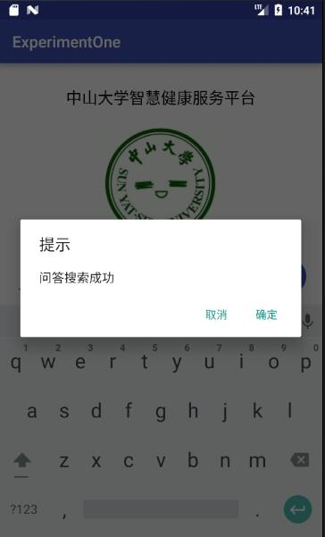  
        点击“确定”，弹出Toast信息——**对话框“确定”按钮被点击**。  
        点击“取消”，弹出Toast 信息——**对话框“取消”按钮被点击**。  
        否则弹出如下对话框，对话框点击效果同上。  
        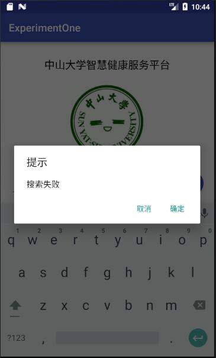  
   2. RadioButton选择项切换：选择项切换之后，弹出Toast信息“**XX被选中**”，例如从图片切换到视频，弹出Toast信息“**视频被选中**”  

### 第六周

本次实验模拟实现一个健康食品列表，有两个界面，第一个界面用于呈现食品列表 如下所示  
  
数据在"manual/素材"目录下给出。  
点击右下方的悬浮按钮可以切换到收藏夹  
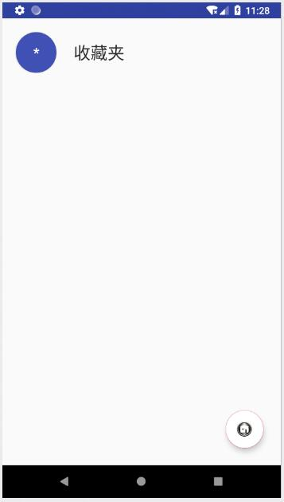   
上面两个列表点击任意一项后，可以看到详细的信息：  
 

#### UI要求  
* 食品列表  
      每一项为一个圆圈和一个名字，圆圈和名字都是垂直居中。圆圈内的内容是该食品的种类，内容要处于圆圈的中心，颜色为白色。食品名字为黑色，圆圈颜色自定义，只需能看见圆圈内的内容即可。
* 收藏夹  
      与食品列表相似
* 食品详情界面  
   1. 界面顶部  
     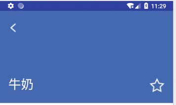  
     顶部占整个界面的1/3。每个食品详情的顶部颜色在数据中已给出。返回图标处于这块区域的左上角，食品名字处于左下角，星标处于右下角，边距可以自己设置。 **返回图标与名字左对齐，名字与星标底边对齐。** 建议用RelativeLayout实现，以熟悉RelativeLayout的使用。  
   2. 界面中部  
       
     使用的黑色argb编码值为#D5000000，稍微偏灰色的“富含”“蛋白质”的argb编码值为#8A000000。"更多资料"一栏上方有一条分割线，argb编码值为#1E000000。右边收藏符号的左边也有一条分割线，要求与收藏符号高度一致，垂直居中。字体大小自定。"更多资料"下方分割线高度自定。这部分所有的分割线argb编码值都是#1E000000。  
   3. 界面底部  
       
     使用的黑色argb编码值为#D5000000。  
* 标题栏  
      两个界面的标题栏都需要去掉  

#### 功能要求
* 使用RecyclerView实现食品列表。点击某个食品会跳转到该食品的详情界面，呈现该食品的详细信息。长按列表中某个食品会删除该食品，并弹出Toast，提示 **"删除XX"** 。
* 点击右下方的FloatingActionButton，从食品列表切换到收藏夹或从收藏夹切换到食品列表，并且该按钮的图片作出相应改变。
* 使用ListView实现收藏夹。点击收藏夹的某个食品会跳转到食品详情界面，呈现该食品的详细信息。长按收藏夹中的某个食品会弹出对话框询问是否移出该食品，点击确定则移除该食品，点击取消则对话框消失。如长按“鸡蛋”，对话框内容如下图所示。  
  
* 商品详情界面中点击返回图标会返回上一层。点击星标会切换状态，如果原本是空心星星，则会变成实心星星；原本是实心星星，则会变成空心星星。点击收藏图表则将该食品添加到收藏夹并弹出Toast提示 **"已收藏"** 。

---

## 三、实验结果

### 第四周实验结果

#### (1)实验截图

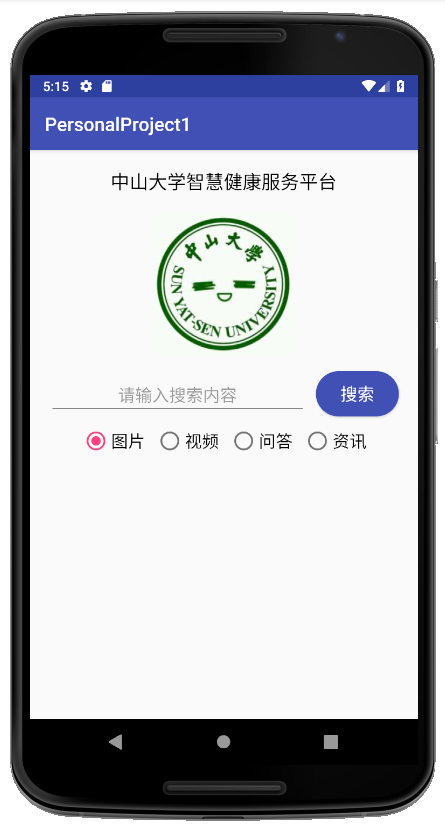

#### (2)实验步骤以及关键代码

##### 标题

- `text` 属性引用了定义在 `strings.xml` 中的字符串 `title` ，其值为“中山大学智慧健康服务平台”
- 颜色设为黑色，字体大小为20sp，顶部外边距为20dp
- 通过将左右边分别约束到父容器的左右边，来设置居中

```xml
    <TextView
        android:id="@+id/title"
        android:layout_width="wrap_content"
        android:layout_height="wrap_content"
        android:text="@string/title"
        android:textColor="#000000"
        android:textSize="20sp"
        android:layout_marginTop="20dp"
        app:layout_constraintTop_toTopOf="parent"
        app:layout_constraintLeft_toLeftOf="parent"
        app:layout_constraintRight_toRightOf="parent" />
```

##### 图片

- 上下外边距设为20dp

```xml
    <ImageView
        android:id="@+id/imageSYSU"
        android:layout_width="wrap_content"
        android:layout_height="wrap_content"
        android:layout_marginVertical="20dp"
        android:src="@mipmap/sysu"
        app:layout_constraintLeft_toLeftOf="parent"
        app:layout_constraintRight_toRightOf="parent"
        app:layout_constraintTop_toBottomOf="@id/title"
        app:layout_constraintBottom_toTopOf="@id/searchInput"/>
```

##### 输入框

- `layout_width` 宽度设为0dp，左边约束到父容器，右边约束到搜索按钮 `search_button` ，以便左右拉伸填满可用空间
- 字体大小为18sp
- `hint` 属性引用了定义在 `strings.xml` 中的字符串 `hint_search` ，其值为“请输入搜索内容”
- `gravity` 属性设为 `center` ，以使提示内容居中
- 底部约束到搜索按钮 `search_button` 的底部，使两者底部对齐

```xml
    <EditText
        android:id="@+id/searchInput"
        android:layout_width="0dp"
        android:layout_height="wrap_content"
        android:textSize="18sp"
        android:hint="@string/hint_search"
        android:gravity="center"
        android:layout_marginLeft="20dp"
        app:layout_constraintLeft_toLeftOf="parent"
        app:layout_constraintRight_toLeftOf="@id/searchButton"
        app:layout_constraintTop_toBottomOf="@id/imageSYSU"
        app:layout_constraintBottom_toBottomOf="@id/searchButton"/>
```

##### 搜索按钮

- 内容引用了定义在 `strings.xml` 中的字符串 `button_search` ，其值为“搜索”
- 内容字体大小为18sp，字的颜色设为白色
- 水平内边距设为10dp，纵向内边距设为5dp
- `background` 属性引用了定义在 `drawable` 目录下的 `button_shape` 样式表，将圆角半径设为180dp，背景色引用 `colors.xml` 文件中预定义的 `colorPrimary` ，即 `#3F51B5`

```xml
    <Button
        android:id="@+id/searchButton"
        android:layout_width="wrap_content"
        android:layout_height="wrap_content"
        android:text="@string/button_search"
        android:textSize="18sp"
        android:textColor="#FFFFFF"
        android:paddingHorizontal="10dp"
        android:paddingVertical="5dp"
        android:layout_marginLeft="10dp"
        android:layout_marginRight="20dp"
        android:background="@drawable/button_shape"
        app:layout_constraintLeft_toRightOf="@id/searchInput"
        app:layout_constraintRight_toRightOf="parent"
        app:layout_constraintBottom_toBottomOf="@id/searchInput"/>
```

```xml
<shape xmlns:android="http://schemas.android.com/apk/res/android">
    <corners android:radius="180dp" />
    <gradient
        android:startColor="@color/colorPrimary"
        android:centerColor="@color/colorPrimary"
        android:endColor="@color/colorPrimary" />
</shape>
```

##### 单选按钮组

- 顶部外边距设为10sp，即到输入框的距离


- `orientation` 属性设为水平方向，使其中的单选按钮以水平方向排列
- `checkedButton` 属性引用了单选按钮 `radio_image` 的 `id` ，表示默认选中“图片”选项
- 每个单选按钮的 `style` 属性都引用了定义在 `styles.xml` 中的 `SearchRadioButton` 样式，字体大小为18sp，水平外边距为5dp以使单选按钮之间相隔10dp

```xml
    <RadioGroup
        android:id="@+id/searchTypes"
        android:layout_width="wrap_content"
        android:layout_height="wrap_content"
        android:layout_marginTop="10dp"
        android:orientation="horizontal"
        android:checkedButton="@id/radioImage"
        app:layout_constraintLeft_toLeftOf="parent"
        app:layout_constraintRight_toRightOf="parent"
        app:layout_constraintTop_toBottomOf="@id/searchInput">
        <RadioButton
            android:id="@+id/radioImage"
            android:layout_width="wrap_content"
            android:layout_height="wrap_content"
            android:text="图片"
            style="@style/SearchRadioButton"/>
        <RadioButton
            android:layout_width="wrap_content"
            android:layout_height="wrap_content"
            android:text="视频"
            style="@style/SearchRadioButton"/>
        <RadioButton
            android:layout_width="wrap_content"
            android:layout_height="wrap_content"
            android:text="问答"
            style="@style/SearchRadioButton"/>
        <RadioButton
            android:layout_width="wrap_content"
            android:layout_height="wrap_content"
            android:text="资讯"
            style="@style/SearchRadioButton"/>
    </RadioGroup>
```

```xml
    <style name="SearchRadioButton">
        <item name="android:layout_marginHorizontal">5dp</item>
        <item name="android:textSize">18sp</item>
    </style>
```


#### (3)实验遇到的困难以及解决思路

- **标题设置了 `layout_marginTop="20dp"` 后，距离顶端仍为0。**

增加设置 `layout_constraintTop_toTopOf="parent"` ，将标题顶部约束到父容器顶部，就可以解决了。

也可以通过设置 `layout_paddingTop="20dp"` 来解决。

- **输入框的宽度不理想。**

将输入框的左边约束到父容器左边，右边约束到搜索按钮的左边，设置 `layout_width="0dp"` 就可以使得输入框拉伸宽度以填满可用的空间。

- **RadioGroup的默认选项设置问题。**

一开始我是设置“图片”选项对应的单选按钮 `radio_image` 的 `checked` 属性为 `true` ，但这样的话，选中“图片”以外的选项时，“图片”这个选项也依然显示选中的状态，这违反了单选按钮组的规则。

然后我改成设置 `RadioGroup` 的 `checkedButton` 属性为 `@id/radio_image` ，这样才是设置单选按钮组的默认选项的正确方式。

- **设置部分属性时，提示最小SDK版本过低。**

有些属性，如 `layout_marginVertical` ，需要API 26及以上的版本支持。原先设置的最小SDK版本是15，可以在 `build.gradle(Module: app)` 中修改 `minSdkVersion` 的值为26。


### 第五周实验结果

#### (1)实验截图

- 搜索内容不能为空

  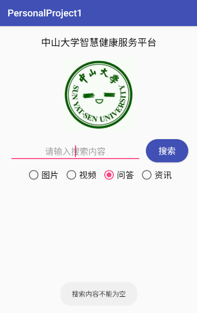

- 切换单选按钮，显示Toast

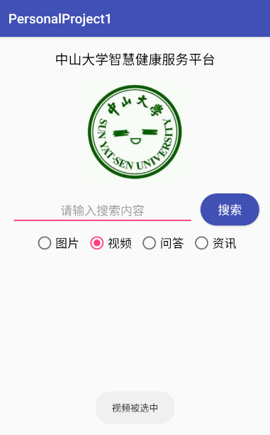

- 搜索失败

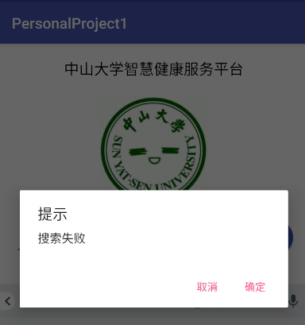

- 点击对话框的“确定”按钮，显示Toast

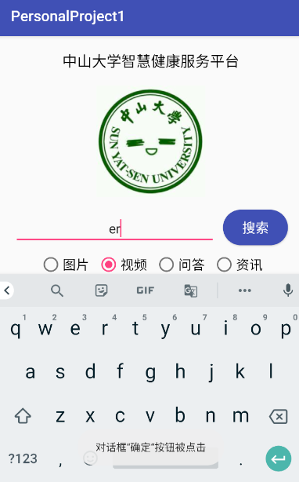

- 输入Health后搜索成功

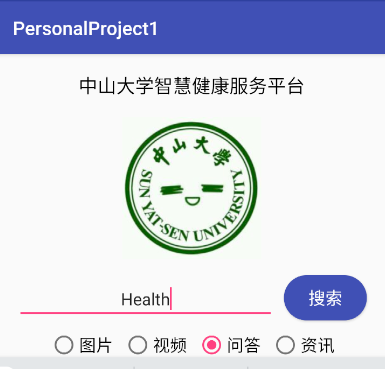

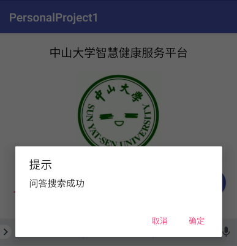

- 点击对话框的”取消“按钮，显示Toast

  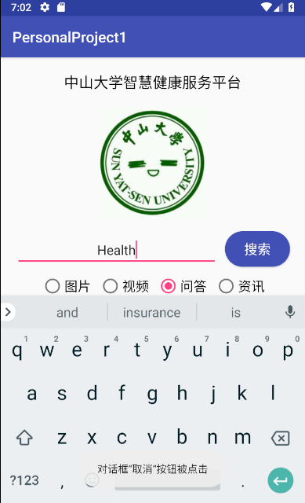


- 将搜索类型更改为“资讯”，重新搜索，可见“资讯搜索成功”，搜索提示信息可随选择的搜索类型而变化

  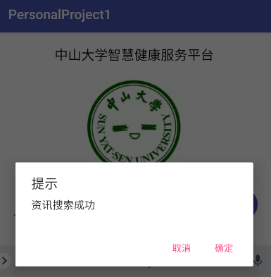

#### (2)实验步骤以及关键代码

##### 声明和获取所需控件

获取输入框、搜索按钮、单选按钮组。

```java
public class MainActivity extends AppCompatActivity {

    private EditText searchInput;
    private Button searchButton;
    private RadioGroup searchTypes;
    private AlertDialog.Builder alert;
  
  	@Override
    protected void onCreate(Bundle savedInstanceState) {
        super.onCreate(savedInstanceState);
        setContentView(R.layout.activity_main);

        searchInput = (EditText)findViewById(R.id.searchInput);
        searchButton = (Button)findViewById(R.id.searchButton);
        searchTypes = (RadioGroup)findViewById(R.id.searchTypes);
      
      	// ...
    }
  	// ...
}
```

##### 创建对话框

在 `MainActivity` 类的 `protected void onCreate(Bundle savedInstanceState)` 方法体内，有：

```java
alert = new AlertDialog.Builder(MainActivity.this);
alert.setTitle("提示");
alert.setNegativeButton("取消", new DialogInterface.OnClickListener() {
    @Override
    public void onClick(DialogInterface dialog, int which) {
        Toast.makeText(MainActivity.this, "对话框“取消“按钮被点击", Toast.LENGTH_SHORT).show();
    }
});
alert.setPositiveButton("确定", new DialogInterface.OnClickListener() {
    @Override
    public void onClick(DialogInterface dialog, int which) {
        Toast.makeText(MainActivity.this, "对话框“确定“按钮被点击", Toast.LENGTH_SHORT).show();
    }
});
alert.create();
```

##### 搜索按钮的点击事件

在 `activity_main.xml` 中，为 `searchButton` 引入 `onClick` 属性，设置点击事件调用的方法：

```xml
<Button
	android:id="@+id/searchButton"
	android:onClick="onSearchButtonClick" 
	.../>
```

在 `MainActivity.java` 中，有如下被调用的方法：

```java
public void onSearchButtonClick(View view) {
  // 如果搜索内容为空，弹出Toast“搜索内容不能为空”
  if(TextUtils.isEmpty(searchInput.getText().toString())){
    Toast.makeText(MainActivity.this, "搜索内容不能为空", Toast.LENGTH_SHORT).show();
  }
  else if(TextUtils.equals(searchInput.getText().toString(), "Health")){
    // 如果搜索内容为"Health"，弹出对话框“XX搜索成功”，其中XX表示搜索类型
    RadioButton radioButton = (RadioButton)findViewById(searchTypes.getCheckedRadioButtonId());
    alert.setMessage(radioButton.getText().toString() + "搜索成功");
    alert.show();
  }
  else{
    alert.setMessage("搜索失败");
    alert.show();
  }
}
```

##### 单选按钮组的切换按钮事件

在 `MainActivity` 类的 `protected void onCreate(Bundle savedInstanceState)` 方法体内，有：

```java
searchTypes.setOnCheckedChangeListener(new RadioGroup.OnCheckedChangeListener() {
  @Override
  public void onCheckedChanged(RadioGroup group, int checkedId) {
    RadioButton radioButton = (RadioButton)findViewById(searchTypes.getCheckedRadioButtonId());
    Toast.makeText(MainActivity.this, radioButton.getText().toString() + "被选中", Toast.LENGTH_SHORT).show();
  }
});
```


#### (3)实验遇到的困难以及解决思路

- 试图像在 `activity_main.xml` 文件中为搜索按钮引入 `onClick` 属性、在 `MainActivity.java` 中定义按钮点击事件所调用的方法那样，也通过 `xml` 文件来设置单选按钮组的更改按钮事件，于是引入了单选按钮组的 `onClick` 属性并编写相关方法。但是失败了，不能实现所需要的效果：改变所选的单选选项时，显示相应的Toast。


经查询，`RadioGroup` 似乎没有和监听选项更改事件有关的属性。只能通过为单选按钮组添加 `RadioGroup.OnCheckedChangeListener`  来监听选项更改事件。

### 第六周实验结果

#### (1)实验截图

##### 食品列表和收藏夹列表切换

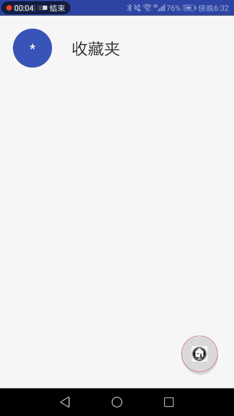

##### 食品详情界面：星形按钮点击、返回

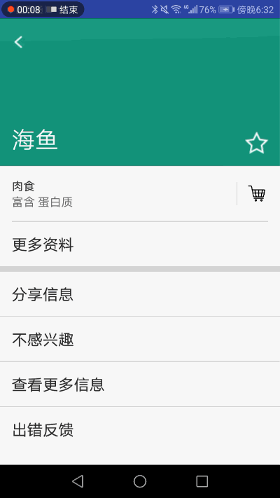

##### 收藏食品

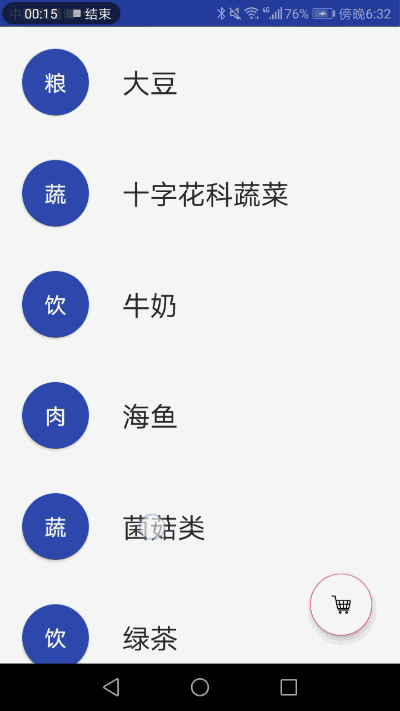

##### 删除收藏夹列表里的项

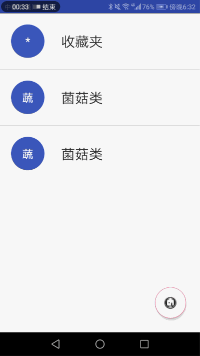

##### 删除食品列表里的项

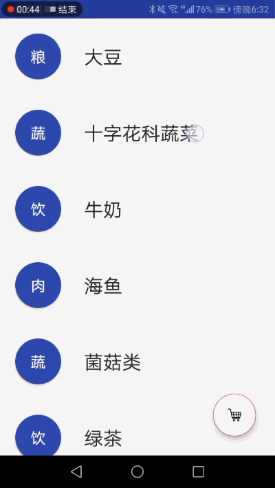

#### (2)实验步骤以及关键代码

##### 食品列表 / 收藏夹布局文件 `activity_collection.xml`

```xml
	<ListView
        android:id="@+id/collectionList"
        android:visibility="invisible"
        android:layout_width="match_parent"
        android:layout_height="wrap_content"
        app:layout_constraintTop_toTopOf="parent"/>

    <android.support.v7.widget.RecyclerView
        android:id="@+id/foodList"
        android:visibility="visible"
        android:layout_width="match_parent"
        android:layout_height="wrap_content"
        app:layout_constraintTop_toTopOf="parent" />

    <android.support.design.widget.FloatingActionButton
        android:id="@+id/switchButton"
        android:onClick="onSwitchButtonClick"
        android:layout_width="wrap_content"
        android:layout_height="wrap_content"
        android:src="@mipmap/collect"
        android:backgroundTint="@color/colorWhite"
        android:backgroundTintMode="src_atop"
        app:layout_constraintBottom_toBottomOf="parent"
        app:layout_constraintRight_toRightOf="parent"
        android:layout_margin="25dp" />
```

##### 食品列表/收藏夹的项布局文件 `item.xml`

使用 `RelativeLayout` 布局，有两个子控件，一个是 `Button` 类型的 `shortKind` ，表示种类的缩写，一个是 `TextView` 类型的 `name` ，表示食品名称。

`shortKind` 使用的按钮样式定义于 `res/drawable/short_shape.xml` ，如下：

```xml
<shape xmlns:android="http://schemas.android.com/apk/res/android">
    <corners android:radius="180dp" />
    <gradient
        android:startColor="@color/colorPrimary"
        android:centerColor="@color/colorPrimary"
        android:endColor="@color/colorPrimary" />
</shape>
```

`item.xml` 如下：

```xml
<RelativeLayout xmlns:android="http://schemas.android.com/apk/res/android"
    android:layout_width="match_parent"
    android:layout_height="wrap_content"
    android:descendantFocusability="blocksDescendants">

    <Button
        android:id="@+id/shortKind"
        android:textSize="20sp"
        android:textColor="@color/colorWhite"
        android:layout_width="60dp"
        android:layout_height="60dp"
        android:background="@drawable/short_shape"
        android:layout_alignParentLeft="true"
        android:layout_centerVertical="true"
        android:layout_margin="20dp"
        />

    <TextView
        android:id="@+id/name"
        android:textSize="25sp"
        android:textColor="@color/colorBlack"
        android:layout_width="wrap_content"
        android:layout_height="wrap_content"
        android:layout_toRightOf="@id/shortKind"
        android:layout_centerVertical="true"
        android:layout_margin="10dp"/>

</RelativeLayout>
```

##### 设计食品列表的RecyclerView

###### `FoodListHolder` 类

作为 `ViewHolder` 。

```java
public class FoodListHolder extends RecyclerView.ViewHolder implements AnimateViewHolder{
    private View view;  // item的父视图，即 RelativeLayout
    private Button shortKind;
    private TextView name;

    public FoodListHolder(Context _context, View _view, ViewGroup _viewGroup){
        super(_view);
        view = _view;
        shortKind = null;
        name = null;
    }


    // 由传入的视图获取要缓存的子视图
    public FoodListHolder(View _view){
        super(_view);
        view = _view;
        shortKind = view.findViewById(R.id.shortKind);
        name = view.findViewById(R.id.name);
    }

    // 获取FoodListHolder实例
    public static FoodListHolder getInstance(Context _context, ViewGroup _viewGroup, int _layoutId){
        View _view = LayoutInflater.from(_context).inflate(_layoutId, _viewGroup, false);
        FoodListHolder holder = new FoodListHolder(_context, _view, _viewGroup);
        return holder;
    }

    // 设置种类缩写
    public void setShortKind(String text){
        shortKind.setText(text);
    }

    // 设置食品名称
    public void setName(String text){
        name.setText(text);
    }

    // 设置删除项的动画
    @Override
    public void animateRemoveImpl(RecyclerView.ViewHolder holder, ViewPropertyAnimatorListener listener) {
        ViewCompat.animate(itemView).translationX(itemView.getWidth() * 2)
                .alpha(0)
                .scaleX(0)
                .scaleY(0)
                .setDuration(300)
                .setListener(listener)
                .start();
    }
}
```

###### `FoodListAdapter` 类

作为 `RecyclerView` 的 `Adapter` 。

```java
public class FoodListAdapter extends RecyclerView.Adapter<FoodListHolder>{
    private Context context;
    private ArrayList<Food> data;

    public interface OnItemClickListener{
        void onClick(int pos);
        void onLongClick(int pos);
    }

    private OnItemClickListener onItemClickListener;

    public FoodListAdapter(Context context, ArrayList<Food> data){
        this.context = context;
        this.data = data;
    }

    @NonNull
    @Override
    public FoodListHolder onCreateViewHolder(@NonNull ViewGroup parent, int viewType) {
        View view = View.inflate(context, R.layout.item, null);
        return new FoodListHolder(view);
    }

    // 给item的视图绑定ViewHolder，加载每个item要显示的数据，并设置点击和长按事件
    @Override
    public void onBindViewHolder(@NonNull final FoodListHolder foodListHolder,final int pos) {
        foodListHolder.setShortKind(data.get(pos).getKind());
        foodListHolder.setName(data.get(pos).getName());

        if(onItemClickListener != null){
            foodListHolder.itemView.setOnClickListener(new View.OnClickListener(){
                @Override
                public void onClick(View v) {
                    onItemClickListener.onClick(pos);
                }
            });
            foodListHolder.itemView.setOnLongClickListener(new View.OnLongClickListener() {
                @Override
                public boolean onLongClick(View v) {
                    onItemClickListener.onLongClick(pos);
                    return true;
                }
            });
        }
    }

    public void setOnItemClickListener(OnItemClickListener _onItemClickListener){
        this.onItemClickListener = _onItemClickListener;
    }

    public int getItemCount(){
        return data == null ? 0 : data.size();
    }
  
  	// ...
}
```

###### 在 `CollectionActivity.java` 中设置 `RecyclerView` 

```java
        // 设置食品列表
        foodList = findViewById(R.id.foodList);
        LinearLayoutManager layoutManager = new LinearLayoutManager(
                CollectionActivity.this, LinearLayoutManager.VERTICAL, false);
        foodList.setLayoutManager(layoutManager);
        final ArrayList<Food> data = FoodMap.getInstance().getSimpleFoodList();
        foodListAdapter = new FoodListAdapter(CollectionActivity.this, data);
        foodListAdapter.setOnItemClickListener(new FoodListAdapter.OnItemClickListener() {
            // 设置食品列表项的点击事件：跳转详情界面
            @Override
            public void onClick(int pos) {
                Intent intent = new Intent(CollectionActivity.this, DetailActivity.class);
                String name = data.get(pos).getName();
                intent.putExtra("name", name);
                startActivityForResult(intent, 0);
            }

            // 设置食品列表项的长按事件：删除
            @Override
            public void onLongClick(int pos) {
                Toast.makeText(CollectionActivity.this, "删除" + data.get(pos).getName(), Toast.LENGTH_SHORT).show();
                foodListAdapter.notifyItemRemoved(pos);
                data.remove(pos);
                //notifyItemRemoved(pos);
                foodListAdapter.notifyItemRangeChanged(pos, foodListAdapter.getItemCount());
            }
        });
        foodList.setAdapter(foodListAdapter);
```

##### RecyclerView自定义动画

先在 `CollectionActivity.java` 的 `onCreate` 方法里为 `foodList` 添加 `ItemAnimator` ，引入项动画：

```java
        foodList.setItemAnimator(new FadeInAnimator()); 
```

然后可在 `FoodListHolder` 里实现 `AnimateViewHolder` 接口，以覆盖这个 `ItemAnimator` 里的动画效果：

```java
public class FoodListHolder extends RecyclerView.ViewHolder implements AnimateViewHolder{
    // ...

    // 设置删除项的动画
    @Override
    public void animateRemoveImpl(RecyclerView.ViewHolder holder, ViewPropertyAnimatorListener listener) {
        ViewCompat.animate(itemView).translationX(itemView.getWidth() * 2)
                .alpha(0)
                .scaleX(0)
                .scaleY(0)
                .setDuration(300)
                .setListener(listener)
                .start();
    }

    // ...
}
```

在这里我只自定义了删除的项动画。

##### 设计收藏夹列表的ListView

###### `CollectionListHolder` 类

作为 `ViewHolder` ，辅助 `Adapter` 。

定义在 `CollectionListAdapter` 类里：

```java
    private class ViewHolder{
        public Button shortKind;
        public TextView name;
    }
```

###### `CollectionListAdaper` 类

作为 `ListView` 的自定义 `Adapter` 。

```java
public class CollectionListAdapter extends BaseAdapter {
    private ArrayList<Food> collections;
    private Context context;

    public CollectionListAdapter(Context _context, ArrayList<Food> _collections){
        collections = _collections;
        context = _context;
    }

    @Override
    public int getCount() {
        return collections == null ? 0 : collections.size();
    }

    @Override
    public long getItemId(int i) {
        return i;
    }

    @Override
    public Object getItem(int i) {
        return collections == null ? null : collections.get(i);
    }

    @Override
    public View getView(int i, View view, ViewGroup viewGroup) {
        View convertView;
        ViewHolder viewHolder;
        if(view == null){
            convertView = LayoutInflater.from(context).inflate(R.layout.item, null);
            viewHolder = new ViewHolder();
            viewHolder.shortKind = convertView.findViewById(R.id.shortKind);
            viewHolder.name = convertView.findViewById(R.id.name);
            convertView.setTag(viewHolder);
        }
        else{
            convertView = view;
            viewHolder = (ViewHolder)convertView.getTag();
        }
        viewHolder.shortKind.setText(collections.get(i).getKind());
        viewHolder.name.setText(collections.get(i).getName());
        return convertView;
    }

    public void add(Food food){
        collections.add(food);
        notifyDataSetChanged();
    }

    public void remove(int pos){
        collections.remove(pos);
        notifyDataSetChanged();
    }

    private class ViewHolder{
        public Button shortKind;
        public TextView name;
    }
}
```

###### 在 `CollectionActivity.java` 中设置 `ListView`

```java
        // 设置收藏夹列表
        collectionList = findViewById(R.id.collectionList);
        final ArrayList<Food> collections = new ArrayList<>();
        collections.add(new Food("收藏夹", "*"));
        final CollectionListAdapter collectionListAdapter =
                new CollectionListAdapter(CollectionActivity.this, collections);
        collectionList.setAdapter(collectionListAdapter);
        // 设置收藏夹列表项的点击事件：跳转食品详情界面
        collectionList.setOnItemClickListener(new AdapterView.OnItemClickListener() {
            @Override
            public void onItemClick(AdapterView<?> parent, View view, int position, long id) {
                if(position == 0) return;   // 如果是第一项（即 * 收藏夹），则无反应

                Intent intent = new Intent(CollectionActivity.this, DetailActivity.class);
                intent.putExtra("name", collections.get(position).getName());
                startActivityForResult(intent, 0);
            }
        });
        // 设置收藏夹列表项的长按事件：删除项
        collectionList.setOnItemLongClickListener(new AdapterView.OnItemLongClickListener() {
            @Override
            public boolean onItemLongClick(AdapterView<?> parent, View view, final int position, long id) {
                if(position == 0) return true;   // 如果是第一项（即 * 收藏夹），则无反应

                AlertDialog.Builder builder=new AlertDialog.Builder(CollectionActivity.this);
                builder.setTitle("删除");
                builder.setMessage("确定删除");
                builder.setPositiveButton("确定", new DialogInterface.OnClickListener() {
                    @Override
                    public void onClick(DialogInterface dialog, int which) {
                        collectionListAdapter.remove(position);
                    }
                });
                builder.setNegativeButton("取消", new DialogInterface.OnClickListener() {
                    @Override
                    public void onClick(DialogInterface dialog, int which) {

                    }
                });
                builder.show();
                return true;
            }
        });
```

##### 食品列表 / 收藏夹的切换

通过设置食品列表和收藏夹的 `visibility` 属性为 `VISIBLE` 或 `INVISIBLE` 来实现。同时改变悬浮按钮的图片。

```java
    // 设置悬浮按钮的点击事件：切换视图
    public void onSwitchButtonClick(View view){
        if(foodList.getVisibility() == View.VISIBLE){
            foodList.setVisibility(View.INVISIBLE);
            collectionList.setVisibility(View.VISIBLE);
            switchButton.setImageResource(R.mipmap.mainpage);
        }
        else{
            collectionList.setVisibility(View.INVISIBLE);
            foodList.setVisibility(View.VISIBLE);
            switchButton.setImageResource(R.mipmap.collect);
        }
    }
```

##### 食品详情布局文件 `activity_detail.xml`

其中，顶部使用 `RelativeLayout` 来实现，通过设置 `layout_constraintHeight_percent` 属性为 `0.33` ，设置 `layout_height` 属性为 `0dp` ，实现顶部高度占屏幕的 $1/3$ 。

中部通过规划约束相对位置来排列食品种类、营养物质、横线、竖线、收藏按钮等元素。

底部使用 `ListView` 实现。

```xml
<?xml version="1.0" encoding="utf-8"?>
<android.support.constraint.ConstraintLayout xmlns:android="http://schemas.android.com/apk/res/android"
    xmlns:app="http://schemas.android.com/apk/res-auto"
    xmlns:tools="http://schemas.android.com/tools"
    android:layout_width="match_parent"
    android:layout_height="match_parent"
    tools:context=".DetailActivity">

    <RelativeLayout
        android:id="@+id/top"
        android:layout_width="match_parent"
        android:layout_height="0dp"
        app:layout_constraintHeight_percent="0.33"
        android:background="@color/colorPurple"
        app:layout_constraintBottom_toTopOf="@id/kind">
        <ImageButton
            android:id="@+id/back"
            android:onClick="onBackButtonClick"
            android:background="@mipmap/back"
            android:layout_width="30dp"
            android:layout_height="30dp"
            android:layout_margin="15dp"
            android:layout_alignParentLeft="true" />

        <TextView
            android:id="@+id/name"
            android:layout_width="wrap_content"
            android:layout_height="wrap_content"
            android:layout_alignParentLeft="true"
            android:layout_alignParentBottom="true"
            android:layout_margin="15dp"
            android:layout_toEndOf="@id/back"
            android:textColor="@color/colorWhite"
            android:textSize="30sp" />

        <ImageButton
            android:id="@+id/starButton"
            android:layout_width="30dp"
            android:layout_height="30dp"
            android:layout_alignParentBottom="true"
            android:layout_alignParentRight="true"
            android:layout_margin="15dp"
            android:adjustViewBounds="true"
            android:background="@mipmap/empty_star"
            android:onClick="onStarButtonClick" />
    </RelativeLayout>

    <TextView
        android:id="@+id/kind"
        android:layout_width="match_parent"
        android:layout_height="wrap_content"
        android:layout_marginHorizontal="15dp"
        android:layout_marginVertical="15dp"
        android:textColor="@color/colorBlack"
        android:textSize="15sp"
        app:layout_constraintLeft_toLeftOf="parent"
        app:layout_constraintRight_toLeftOf="@id/verticalLine"
        app:layout_constraintTop_toBottomOf="@id/top" />

    <TextView
        android:id="@+id/nutrient"
        android:layout_width="match_parent"
        android:layout_height="wrap_content"
        android:layout_marginHorizontal="15dp"
        android:paddingBottom="15dp"
        android:textColor="@color/colorGreyNutrient"
        android:textSize="15sp"
        app:layout_constraintRight_toLeftOf="@id/verticalLine"
        app:layout_constraintLeft_toLeftOf="parent"
        app:layout_constraintTop_toBottomOf="@id/kind"
        app:layout_constraintBottom_toTopOf="@id/horizontalLine"/>

    <View
        android:id="@+id/verticalLine"
        android:layout_width="0.5dp"
        android:layout_height="0dp"
        android:layout_marginHorizontal="10dp"
        android:background="@color/colorGreySplit"
        app:layout_constraintTop_toTopOf="@id/collectButton"
        app:layout_constraintBottom_toBottomOf="@id/collectButton"
        app:layout_constraintRight_toLeftOf="@id/collectButton" />

    <ImageButton
        android:id="@+id/collectButton"
        android:layout_width="30dp"
        android:layout_height="30dp"
        android:layout_margin="15dp"
        android:onClick="onCollectButtonClick"
        android:background="@mipmap/collect"
        app:layout_constraintTop_toBottomOf="@id/top"
        app:layout_constraintBottom_toTopOf="@id/horizontalLine"
        app:layout_constraintRight_toRightOf="parent" />

    <View
        android:id="@+id/horizontalLine"
        android:layout_width="match_parent"
        android:layout_height="1dp"
        android:layout_marginHorizontal="15dp"
        android:background="@color/colorGreySplit"
        app:layout_constraintTop_toBottomOf="@id/nutrient" />

    <TextView
        android:id="@+id/moreInfo"
        android:layout_width="match_parent"
        android:layout_height="wrap_content"
        android:text="更多资料"
        android:textColor="@color/colorBlack"
        android:textSize="20sp"
        android:layout_margin="15dp"
        app:layout_constraintTop_toBottomOf="@id/horizontalLine"
        app:layout_constraintBottom_toTopOf="@id/horizontalLine2"/>

    <View
        android:id="@+id/horizontalLine2"
        android:layout_width="match_parent"
        android:layout_height="7dp"
        android:background="@color/colorGreySplit"
        app:layout_constraintTop_toBottomOf="@id/moreInfo"
        app:layout_constraintBottom_toTopOf="@id/bottom"/>

    <ListView
        android:id="@+id/bottom"
        android:layout_width="match_parent"
        android:layout_height="wrap_content"
        app:layout_constraintTop_toBottomOf="@id/horizontalLine2">
    </ListView>

</android.support.constraint.ConstraintLayout>
```

##### 详情页面的操作列表的项布局文件 `operation.xml`

```xml
<TextView
    android:id="@+id/operation"
    android:padding="15dp"
    android:textSize="20sp"
    android:textColor="@color/colorBlack"
    android:layout_width="match_parent"
    android:layout_height="wrap_content"
    xmlns:android="http://schemas.android.com/apk/res/android" />
```

##### 详情页面内信息的初始化

定义于 `res/values/strings.xml` 的操作列表：

```xml
    <string-array name="operations">
        <item>分享信息</item>
        <item>不感兴趣</item>
        <item>查看更多信息</item>
        <item>出错反馈</item>
    </string-array>
```

食品详情页面的活动编写于 `DetailActivity.java` 。

```java
    private RelativeLayout top;
    private ListView operationList;
    private ImageButton starButton;
    private boolean collect;
    private boolean fullStar;

	@Override
    protected void onCreate(Bundle savedInstanceState) {
        super.onCreate(savedInstanceState);
        setContentView(R.layout.activity_detail);

        top = findViewById(R.id.top);
        operationList = findViewById(R.id.bottom);
        starButton = findViewById(R.id.starButton);
        collect = false;
        fullStar = false;

      	// 获取上个活动传来的食品名称，并由此设置顶部和中部
        setDetail(this.getIntent().getStringExtra("name"));

      	// 获取操作列表，初始化底部列表
        String[] operations = getResources().getStringArray(R.array.operations);
        operationList.setAdapter(new ArrayAdapter<>(this, R.layout.operation, operations));
    }

    // 设置食品详情（包括名称、种类、营养物质、颜色）
    private void setDetail(String n){
        TextView name = findViewById(R.id.name);
        TextView kind = findViewById(R.id.kind);
        TextView nutrient = findViewById(R.id.nutrient);
        String k = FoodMap.getInstance().getKind(n);
        String nu = "富含 " + FoodMap.getInstance().getNutrient(n);
        String c = FoodMap.getInstance().getColor(n);

        int id = getResources().getIdentifier(c, "color", this.getPackageName());
        top.setBackgroundColor(getColor(id));
        name.setText(n);
        kind.setText(k);
        nutrient.setText(nu);
    }
```

##### 详情页面的各种点击事件

```java
	// 收藏按钮点击事件
    public void onCollectButtonClick(View view){
        collect = true;
        Toast.makeText(DetailActivity.this, "已收藏", Toast.LENGTH_SHORT).show();
    }

    // 按下顶部的返回按钮返回食品/收藏夹列表
    public void onBackButtonClick(View view){
        Intent intent = new Intent(DetailActivity.this, CollectionActivity.class);
        TextView name = findViewById(R.id.name);
        TextView kind = findViewById(R.id.kind);
        intent.putExtra("name", name.getText());
        intent.putExtra("shortKind", kind.getText().subSequence(0, 1));
        intent.putExtra("collect", collect);
        setResult(RESULT_OK, intent);
        finish();
    }

    // 星形按钮点击事件
    public void onStarButtonClick(View view){
        if(fullStar){
            starButton.setBackgroundResource(R.mipmap.empty_star);
            fullStar = false;
        }
        else{
            starButton.setBackgroundResource(R.mipmap.full_star);
            fullStar = true;
        }
    }

    // 按下底部的系统返回按钮返回
    @Override
    public void onBackPressed() {
        Intent intent = new Intent(DetailActivity.this, CollectionActivity.class);
        TextView name = findViewById(R.id.name);
        TextView kind = findViewById(R.id.kind);
        intent.putExtra("name", name.getText());
        intent.putExtra("shortKind", kind.getText().subSequence(0, 1));
        intent.putExtra("collect", collect);
        setResult(RESULT_OK, intent);
        finish();
    }
```

##### 其他

- 去掉标题栏


```xml
    <style name="AppTheme" parent="Theme.AppCompat.Light.NoActionBar">
        <!-- ... -->
    </style>
```

- 实现分割线


直接使用一个 `View` 类型的控件，填充颜色、设置宽高即可。

```xml
    <View
        android:id="@+id/verticalLine"
        android:layout_width="0.5dp"
        android:layout_height="0dp"
        android:layout_marginHorizontal="10dp"
        android:background="@color/colorGreySplit"
        app:layout_constraintTop_toTopOf="@id/collectButton"
        app:layout_constraintBottom_toBottomOf="@id/collectButton"
        app:layout_constraintRight_toLeftOf="@id/collectButton" />
```

- 实现使用系统返回按钮从食品详情页面返回到食品列表/收藏夹


重写 `onBackPressed` 方法即可。

```java
    // 按下底部的系统返回按钮返回
    @Override
    public void onBackPressed() {
        Intent intent = new Intent(DetailActivity.this, CollectionActivity.class);
        TextView name = findViewById(R.id.name);
        TextView kind = findViewById(R.id.kind);
        intent.putExtra("name", name.getText());
        intent.putExtra("shortKind", kind.getText().subSequence(0, 1));
        intent.putExtra("collect", collect);
        setResult(RESULT_OK, intent);
        finish();
    }
```

- `FoodMap.java` ，存储数据和提供查询


```java
// 存储食品详情的所有数据
class FoodInfo{
    public static final String[][] foodInfo = {
            {"大豆","粮食","蛋白质","colorOrange"},
            {"十字花科蔬菜","蔬菜","维生素C","colorYellow"},
            {"牛奶","饮品","钙","colorPurple"},
            {"海鱼","肉食","蛋白质","colorGreen"},
            {"菌菇类","蔬菜","微量元素","colorOrange"},
            {"绿茶","饮品","无机矿质元素","colorYellow"},
            {"番茄","蔬菜","番茄红素","colorPurple"},
            {"胡萝卜","蔬菜","胡萝卜素","colorGreen"},
            {"荞麦","粮食","膳食纤维","colorOrange"},
            {"鸡蛋","杂","几乎所有营养物质","colorYellow"}
    };
}

// 存储一种食品的详情（包括种类、营养物质、颜色）
class FoodDetail{
    private String foodKind;
    private String foodNutrient;
    private String foodColor;

    public FoodDetail(String k, String n, String c){
        foodKind = k;
        foodNutrient = n;
        foodColor = c;
    }

    public String getFoodKind(){
        return foodKind;
    }

    public String getFoodNutrient() {
        return foodNutrient;
    }

    public String getFoodColor(){
        return foodColor;
    }
}

// 为DetailActivity提供通过食品名称获得详情的查询
// 为CollectionActivity提供获得所有食品名称和种类缩写的查询
public class FoodMap {
    private Map<String, FoodDetail> foodMap;
    private static FoodMap instance;

    protected FoodMap(){
        foodMap = new HashMap<>();
        String[][] info = FoodInfo.foodInfo;
        for(int i = 0; i < info.length; i++){
            foodMap.put(info[i][0], new FoodDetail(info[i][1], info[i][2], info[i][3]));
        }
    }

    public static FoodMap getInstance() {
        if(instance == null){
            instance = new FoodMap();
        }
        return instance;
    }

    public String getKind(String name){
        return foodMap.get(name).getFoodKind();
    }

    public String getNutrient(String name){
        return foodMap.get(name).getFoodNutrient();
    }

    public String getColor(String name){
        return foodMap.get(name).getFoodColor();
    }

    public ArrayList<Food> getSimpleFoodList(){
        ArrayList<Food> list = new ArrayList<>();
        String[][] info = FoodInfo.foodInfo;
        for(int i = 0; i < info.length; i++){
            list.add(new Food(info[i][0], info[i][1].substring(0, 1)));
        }
        return list;
    }
}
```


#### (3) 实验遇到的困难以及解决思路

- **使用 `startActivity ` 方法从搜索界面跳转后，应用最小化回到系统桌面，再次打开应用后也不显示收藏夹界面。**

经过查询资料，发现这是因为我只创建了 `CollectionActivity.java` 和 `activity_collection.xml` 文件，而没有在 `AndroidManifest.xml` 文件中添加必需的 `<activity>` 元素，所以无法正常跳转到另一个活动。

事实上，可以通过 `【New】->【Activity】->【Empty Activity】` 来新建活动，这样就会自动生成对应的布局文件和修改 `AndroidManifest.xml` ，而不必自己手动新建和修改 `Java Class ` 、相应的布局文件以及 `AndroidManifest.xml` 。

- **`cannot resolve symble 'Theme'`** 

在 `styles.xml` 中的`AppTheme` 一行，有如上报错。经过搜索，发现有人遇到了类似的问题，解决办法是去掉 `build.gradle` 里的这两行：

```
    implementation 'com.android.support:appcompat-v7:28.0.0'
    implementation 'com.android.support:design:28.0.0'
```

然后 `Sync Project with Gradle Files` ，再重新加上这两行，再同步一次。这可能是Android Studio的bug。

- **`ImageButton` 的图片无法拉伸以适应按钮大小。**

这是因为是使用 `src` 属性来设置图片源，可以换用 `background` 属性来设置。

- **`ListView` 的项点击无响应。**

查询资料后，我认为这和 `ListView` 的项里包括 `Button` 控件有关，导致项失去焦点，而无法响应项的点击事件。可以通过在 `ListView` 的项布局文件 `item.xml` 中设置 `descendantFocusability` 属性值为 `blocksDescendants` 。

该属性的三个值和对应的意义如下表：

| Constant            | Value | Description                       |
| ------------------- | ----- | --------------------------------- |
| `beforeDescendants` | 0     | `ViewGroup` 会优先于其子视图而获取到焦点。       |
| `afterDescendants`  | 1     | `ViewGroup` 只有当其子视图不需要获取焦点时才获取焦点。 |
| `blocksDescendants` | 2     | `ViewGroup` 会覆盖子视图而直接获取焦点。        |

---

## 四、实验思考及感想

### 第四周

通过第四周实验，我感受到了约束布局的作用，它兼顾了线性布局和相对布局的优点。

在我之前在别的平台编写应用UI的xml文件时，如果像这样要把输入框和输入按钮放在同一行，一般是再定义一个容器来放置它们。

但现在通过约束布局来设置各个部件的位置关系，就不必再定义新的子容器，这减少了渲染的层数，也简化了代码。

### 第五周

在第五周的实验中，有关于搜索按钮的点击事件设置。

一开始，我采用的是tutorial中的通过内部匿名类来设置监听点击事件；但是，后来在网上查询，我发现 `Button` 的点击事件可以通过多种方式来设置，比如编写实现 `OnClickListener` 接口的不匿名的内部类、直接在 `MainActivity` 类实现 `OnClickListener` 接口。

最后我选择了 `xml` 文件引入属性、`java` 文件编写相关方法的方式。我认为，这是代码最简洁的方式。

但是这个方式也有局限，有的控件似乎无法通过这个方式来设置事件，比如前面提到的 `RadioGroup` 和选项更改事件。所以，在编写程序时还是要结合实际，灵活选择实现方式。

### 第六周

1. 在第六周的实验中，主要学习了 `RecyclerView` 和 `ListView` 。`RecyclerView` 的自定义 `Adapter` 和 `ViewHolder` 比较复杂，参考了不少别人的代码而最终确定。但是自定义也使得我们可以灵活地控制 `RecyclerView` 的项，比如自定义点击事件、动画事件等。

2. 为 `RecyclerView` 添加自定义动画也较为困难，一开始我参考的是网上的博客，主要是通过重写 `DefaultItemAnimator` 或继承 `SimpleItemAnimator` 等来实现，不仅代码比较复杂，而且有过时的、不受API 26以上的支持的代码。

   后来参考了这个开源项目 [recyclerview-animators](github.com/wasabeef/recyclerview-animators) 里的文档，通过将 `ViewHolder` 实现 `AnimateViewHolder` 接口重写相关动画方法、`Adapter` 添加 `xxxItemAnimator` ，终于实现了自定义删除动画。

   这让我再一次感受到开源项目的力量，也让我认识到好好阅读官方文档的作用。

   而且，API是更新换代的，我们在开发项目的过程中要注意这一点。

3. 这次的项目给出了多个颜色值，且不同的食品会对应不同的颜色。

   为了避免硬编码，同时提高数据可读性，我选择以 `colorXXX` 的方式存储颜色到食品信息里，将食品与一个颜色名字而非具体的 `#xxxxxx` 值关联到一起：

   ```java
       public static final String[][] foodInfo = {
               {"大豆","粮食","蛋白质","colorOrange"},
               {"十字花科蔬菜","蔬菜","维生素C","colorYellow"},
               {"牛奶","饮品","钙","colorPurple"},
               {"海鱼","肉食","蛋白质","colorGreen"},
               {"菌菇类","蔬菜","微量元素","colorOrange"},
               {"绿茶","饮品","无机矿质元素","colorYellow"},
               {"番茄","蔬菜","番茄红素","colorPurple"},
               {"胡萝卜","蔬菜","胡萝卜素","colorGreen"},
               {"荞麦","粮食","膳食纤维","colorOrange"},
               {"鸡蛋","杂","几乎所有营养物质","colorYellow"}
       };
   ```

   然后，在 `colors.xml` 里定义相关颜色：

   ```xml
       <color name="colorGreen">#20A17B</color>
       <color name="colorOrange">#BB4C3B</color>
       <color name="colorPurple">#4469B0</color>
       <color name="colorYellow">#C48D30</color>
   ```

   如果需要获取颜色值，就根据颜色的名字获取到资源：

   ```java
           int id = getResources().getIdentifier(c, "color", this.getPackageName());
           top.setBackgroundColor(getColor(id));
   ```

