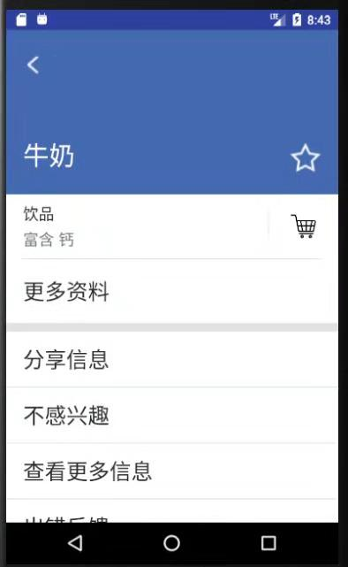

# 实验报告
开始日期  2018/10/17  完成日期  2018/10/31

---

## 一、实验题目

### 第七周

Broadcast的使用：

1. 掌握 Broadcast 编程基础。  
2. 掌握动态注册 Broadcast 和静态注册 Broadcast。
3. 掌握Notification 编程基础。
4. 掌握 EventBus 编程基础。

### 第八周

1. 复习 Broadcast 编程基础。
2. 复习动态注册 Broadcast 和静态注册 Broadcast 。
3. 掌握 AppWidget 编程基础。

---

## 二、实验内容

### 第七周

在第六周任务的基础上，实现静态广播、动态广播两种改变Notification 内容的方法。  

#### 要求

- 在启动应用时，会有通知产生，随机推荐一个食品。  
  
- 点击通知跳转到所推荐食品的详情界面。  
   
- 点击收藏图标，会有对应通知产生，并通过Eventbus在收藏列表更新数据。  
   
- 点击通知返回收藏列表。  
   
- 实现方式要求:启动页面的通知由静态广播产生，点击收藏图标的通知由动态广播产生。   

#### 验收内容

- 静态广播：启动应用是否有随机推荐食品的通知产生。点击通知是否正确跳转到所推荐食品的详情界面。
- 动态广播：点击收藏后是否有提示食品已加入收藏列表的通知产生。同时注意设置launchMode。点击通知是否跳转到收藏列表。
- Eventbus:点击收藏列表图标是否正确添加食品到收藏列表。每点击一次,添加对应的一个食品到收藏列表并产生一条通知。
- 代码+实验报告（都在实验课上检查，暂不需要pr）

### 第八周

在第七周任务的基础上，实现静态广播、动态广播两种改变widget内容的方法。  

#### 要求 
* widget初始情况如下：      
 
* 点击widget可以启动应用，并在widget随机推荐一个食品。      

* 点击widget跳转到所推荐食品的详情界面。     
 
* 点击收藏图标，widget相应更新。     
 
* 点击widget跳转到收藏列表。     
 
* 实现方式要求:启动时的widget更新通过静态广播实现，点击收藏图标时的widget更新通过动态广播实现。 

 

---

#### 验收内容
* 布局显示是否正常。
* 静态广播：启动应用Widget是否有随机推荐食品。
* 动态广播：点击收藏图标后，Widget是否提示食品已加入收藏列表。
* 点击widget是否正确跳到对应的界面。
* 代码+实验报告（先在实验课上检查，检查后再pr）

---

## 三、实验结果
### (1)实验截图

#### 第七周


#### 第八周


### (2)实验步骤以及关键代码

#### 第七周

##### EventBus

- 在 `MainActivity.java` 中

  - 声明传递食品信息的事件类

    ```java
        public static class MessageEvent {
            private String foodName;
            private String shortKind;
    
            public MessageEvent() { }
    
            public MessageEvent(String fn, String sk) {
                foodName = fn;
                shortKind = sk;
            }
    
            public String getFoodName() {
                return foodName;
            }
    
            public String getShortKind() {
                return shortKind;
            }
    
            public void setFoodName(String fn){
                foodName = fn;
            }
    
            public void setShortKind(String sk){
                shortKind = sk;
            }
        }
    ```

  - 声明订阅方法

    ```java
        @Subscribe(threadMode = ThreadMode.MAIN)
        public void onMessageEvent(MessageEvent event){
            CollectionListAdapter adapter = (CollectionListAdapter)collectionList.getAdapter();
            FoodShort food = new FoodShort(event.getFoodName(), event.getShortKind());
            adapter.add(food);
        }
    ```


  - 注册和注销订阅

    ```java
        @Override
        protected void onCreate(Bundle savedInstanceState) {
            // ...
            EventBus.getDefault().register(MainActivity.this);
        }
    
        @Override
        protected void onDestroy() {
            // ...
            EventBus.getDefault().unregister(MainActivity.this);
        }
    ```


- 在 `DetailActivit.java` 中，点击收藏按钮时传递信息

  ```java
      // 收藏按钮点击事件
      public void onCollectButtonClick(View view){
          // ...
  
          // EventBus
          TextView name = findViewById(R.id.name);
          TextView kind = findViewById(R.id.kind);
          String foodName = (String) name.getText();
          String shortKind = (String) kind.getText().subSequence(0, 1);
          EventBus.getDefault().post(new MainActivity.MessageEvent(foodName, shortKind));
        
        	//...
      }
  ```

##### 静态广播和推荐通知

- 在 `MainActivity.java` 中，自定义静态广播接收器类继承 `BroadcastReceiver` ，重写 `onReceive` 方法，处理广播里的数据、发送对应的推荐通知

  ```java
      public static class StaticReceiver extends BroadcastReceiver {
          private static final String STATICACTION = "com.yuyuforest.personalproject2.MyStaticFilter";

          @Override
          public void onReceive(Context context, Intent intent) {
              if(intent.getAction().equals(STATICACTION)) {

                  // 获取数据
                  Bundle bundle = intent.getExtras();
                  Intent intent2 = new Intent(context, DetailActivity.class);
                  intent2.putExtras(bundle);
                  PendingIntent pendingIntent;
                  pendingIntent = PendingIntent.getActivity(context, 0,
                          intent2, PendingIntent.FLAG_CANCEL_CURRENT);

                  // 创建要附加到通知上的PendingIntent
                  String channelID = "recommend";
                  String channelName = "RecommendChannel";
                  NotificationChannel channel = new NotificationChannel(channelID,
                          channelName, NotificationManager.IMPORTANCE_HIGH);
                  NotificationManager manager = (NotificationManager) context.getSystemService(Context.NOTIFICATION_SERVICE);
                  manager.createNotificationChannel(channel);
                  Notification.Builder builder = new Notification.Builder(context, channelID);

                  // 发送通知
                  builder.setContentTitle("今日推荐")
                          .setContentText(bundle.getString("foodName"))
                          .setTicker("您有一条新消息")
                          .setSmallIcon(R.mipmap.empty_star)
                          .setContentIntent(pendingIntent)
                          .setAutoCancel(true);
                  Notification notification = builder.build();
                  manager.notify(0, notification);
              }
          }
      }
	```


- 在 `AndroidManifest.xml` 中注册静态广播

  ```xml
          <receiver android:name=".MainActivity$StaticReceiver"
              android:enabled="true"
              android:exported="false">
              <intent-filter>
                  <action android:name="com.yuyuforest.personalproject2.MyStaticFilter" />
              </intent-filter>
          </receiver>
  ```

- 在 `onCreate` 方法中，发送广播

  ```java
      @Override
      protected void onCreate(Bundle savedInstanceState) {
          // ...
          Random random = new Random();
          int index = random.nextInt(foodListAdapter.getItemCount());
          Bundle bundle = new Bundle();
          bundle.putString("foodName", foodListAdapter.getItemName(index));
          Intent intentBroadcast = new Intent("com.yuyuforest.personalproject2.MyStaticFilter");
          intentBroadcast.putExtras(bundle);
          intentBroadcast.setComponent(new ComponentName(this.getPackageName(),
                  this.getPackageName() + ".MainActivity$StaticReceiver"));
          sendBroadcast(intentBroadcast);
      }
  ```

##### 动态广播和收藏通知

- 在 `DetailActivity` 中，自定义动态广播接收器，重写 `onReceive` 方法

  ```java
      public class DynamicReceiver extends BroadcastReceiver {
          private static final String DYNAMICATION = "com.yuyuforest.personalproject2.MyDynamicFilter";
  
          @Override
          public void onReceive(Context context, Intent intent){
              if(intent.getAction().equals(DYNAMICATION)) {
  
                  // 获取数据
                  Bundle bundle = intent.getExtras();
  
                  // 创建要附加到通知上的PendingIntent
                  Intent intent2 = new Intent(DetailActivity.this, MainActivity.class);
                  Bundle bundle2 = new Bundle();
                  bundle2.putBoolean("collect", true);    // 指示添加到收藏夹
                  intent2.putExtras(bundle2);
                  PendingIntent pendingIntent;
                  pendingIntent = PendingIntent.getActivity(DetailActivity.this, 0,
                          intent2, PendingIntent.FLAG_CANCEL_CURRENT);
  
                  String channelID = "collect";
                  String channelName = "CollectChannel";
                  NotificationChannel channel = new NotificationChannel(channelID,
                          channelName, NotificationManager.IMPORTANCE_HIGH);
                  NotificationManager manager = (NotificationManager) context.getSystemService(Context.NOTIFICATION_SERVICE);
                  manager.createNotificationChannel(channel);
                  Notification.Builder builder = new Notification.Builder(context, channelID);
  
                  // 发送通知
                  builder.setContentTitle("已收藏")
                          .setContentText(bundle.getString("foodName"))
                          .setTicker("您有一条新消息")
                          .setSmallIcon(R.mipmap.full_star)
                          .setContentIntent(pendingIntent)
                          .setAutoCancel(true);
                  Notification notification = builder.build();
                  manager.notify(0, notification);
              }
          }
      }
  ```

- 注册广播和注销广播

  在 `DetailActivity` 中进行。 

  ```java
      protected void onCreate(Bundle savedInstanceState) {
          // ...
  
          // 注册动态广播
          dynamicReceiver = new DynamicReceiver();
          IntentFilter dynamicFilter = new IntentFilter();
          dynamicFilter.addAction("com.yuyuforest.personalproject2.MyDynamicFilter");
          registerReceiver(dynamicReceiver, dynamicFilter);
      }
  
      @Override
      protected void onDestroy() {
          super.onDestroy();
  
          // 注销动态广播
          unregisterReceiver(dynamicReceiver);
      }
  ```

- 发送动态广播

  ```java
      // 收藏按钮点击事件
      public void onCollectButtonClick(View view){
          // ...
        
          // 发送动态广播
          Bundle bundle = new Bundle();
          bundle.putString("foodName", foodName);
          Intent intentBroadcast = new Intent();
          intentBroadcast.setAction("com.yuyuforest.personalproject2.MyDynamicFilter");
          intentBroadcast.putExtras(bundle);
          sendBroadcast(intentBroadcast);
      }
  ```

#### 第八周

##### widget的布局

- `res/layout/my_widget_info.xml`

  主要修改了 `previewImage` 属性，使widget的预览图为实心星星。

  ```xml
  <?xml version="1.0" encoding="utf-8"?>
  <appwidget-provider xmlns:android="http://schemas.android.com/apk/res/android"
      android:previewImage="@mipmap/full_star"></appwidget-provider>
  ```

- `res/xml/my_widget.xml`

  安排widget在桌面的显示方式。

  ```xml
  <RelativeLayout xmlns:android="http://schemas.android.com/apk/res/android"
      android:layout_width="match_parent"
      android:layout_height="match_parent"
      android:background="#00000000"
      android:padding="@dimen/widget_margin">
  
      <ImageView
          android:id="@+id/widgetImage"
          android:layout_width="50dp"
          android:layout_height="50dp"
          android:layout_centerVertical="true"
          android:background="@mipmap/full_star"/>
      
      <TextView
          android:id="@+id/widgetText"
          android:layout_width="wrap_content"
          android:layout_height="wrap_content"
          android:layout_toRightOf="@id/widgetImage"
          android:layout_centerVertical="true"
          android:layout_margin="8dp"
          android:contentDescription="@string/appwidget_text"
          android:text="@string/appwidget_text"
          android:textColor="#ffffff"
          android:textSize="15sp" />
  
  </RelativeLayout>
  ```

##### 自定义的widget

自定义 `MyWidget` 继承 `AppWidgetProvider` ，重写 `onUpdate` 方法，控制widget的初始化界面。

```java
public class MyWidget extends AppWidgetProvider {

    @Override
    public void onUpdate(Context context, AppWidgetManager appWidgetManager, int[] appWidgetIds) {
        RemoteViews updateView = new RemoteViews(context.getPackageName(), R.layout.my_widget);
        Intent intent = new Intent(context, MainActivity.class);
        PendingIntent pending = PendingIntent.getActivity(context, 0, intent, PendingIntent.FLAG_UPDATE_CURRENT);
        updateView.setOnClickPendingIntent(R.id.widgetImage, pending);
        ComponentName cn = new ComponentName(context, MyWidget.class);
        appWidgetManager.updateAppWidget(cn, updateView);
    }
}
```

##### widget的静态广播和推荐

- 重写自定义的 `widget` 类 `MyWidget` 的 `onReceive` 方法

  ```java
  public class MyWidget extends AppWidgetProvider {
      private static final String WIDGETSTATICACTION = "com.yuyuforest.personalproject2.MyWidgetStaticFilter";
  
      @Override
      public void onReceive(Context context, Intent intent) {
          super.onReceive(context, intent);
          AppWidgetManager appWidgetManager = AppWidgetManager.getInstance(context);
          Bundle bundle = intent.getExtras();
          if(intent.getAction().equals(WIDGETSTATICACTION)) {
              CharSequence newText = (CharSequence) bundle.get("foodName");
              RemoteViews views = new RemoteViews(context.getPackageName(), R.layout.my_widget);
              views.setTextViewText(R.id.widgetText, "今日推荐 " + newText);
              Intent i = new Intent(context, DetailActivity.class);
              i.putExtras(bundle);
              PendingIntent pending = PendingIntent.getActivity(context, 0, i, PendingIntent.FLAG_UPDATE_CURRENT);
              views.setOnClickPendingIntent(R.id.widgetImage, pending);
              ComponentName cn = new ComponentName(context, MyWidget.class);
              appWidgetManager.updateAppWidget(cn, views);
          }
      }
  }
  ```

- 在 `AndroidManifest.xml` 中注册

  ```xml
          <receiver android:name=".MyWidget">
              <intent-filter>
                  <action android:name="android.appwidget.action.APPWIDGET_UPDATE" />
                  <action android:name="com.yuyuforest.personalproject2.MyWidgetStaticFilter" />
              </intent-filter>
  
              <meta-data
                  android:name="android.appwidget.provider"
                  android:resource="@xml/my_widget_info" />
          </receiver>
  ```

- 推荐食品，发送静态广播给widget

  在 `MainActivity` 创建、重新启动时进行。

  ```java
      @Override
      protected void onCreate(Bundle savedInstanceState) {
          // ...
  
          Random random = new Random();
          int index = random.nextInt(foodListAdapter.getItemCount());
          Bundle bundle = new Bundle();
          bundle.putString("foodName", foodListAdapter.getItemName(index));
          // ...
  
          // 发送静态广播，以刷新widget
          String widgetStaticAction = "com.yuyuforest.personalproject2.MyWidgetStaticFilter";
          Intent widgetIntentBroadcast = new Intent(widgetStaticAction);
          widgetIntentBroadcast.putExtras(bundle);
          widgetIntentBroadcast.setComponent(new ComponentName(this.getPackageName(),
                  this.getPackageName() + ".MyWidget"));
          sendBroadcast(widgetIntentBroadcast);
      }
  
  	@Override
      protected void onRestart() {
          super.onRestart();
  
          // 发送静态广播，以刷新widget
          Random random = new Random();
          int index = random.nextInt(foodListAdapter.getItemCount());
          Bundle bundle = new Bundle();
          bundle.putString("foodName", foodListAdapter.getItemName(index));
          String widgetStaticAction = "com.yuyuforest.personalproject2.MyWidgetStaticFilter";
          Intent widgetIntentBroadcast = new Intent(widgetStaticAction);
          widgetIntentBroadcast.putExtras(bundle);
          widgetIntentBroadcast.setComponent(new ComponentName(this.getPackageName(),
                  this.getPackageName() + ".MyWidget"));
          sendBroadcast(widgetIntentBroadcast);
      }
  ```

##### widget的动态广播和收藏

- 在 `DetailActivity` 中，重写自定义的动态广播接收器的 `onReceive` 方法

  ```java
  public class DetailActivity extends AppCompatActivity {
      // ...
      
  	public class DynamicReceiver extends BroadcastReceiver {
          private static final String DYNAMICATION = "com.yuyuforest.personalproject2.MyDynamicFilter";
          private static final String WIDGETDYNAMICACTION = "com.yuyuforest.personalproject2.MyWidgetDynamicFilter";
  
          @Override
          public void onReceive(Context context, Intent intent){
              // 收到需要发送通知的广播
              if(intent.getAction().equals(DYNAMICATION)) {
                  // ...
              }
              else if(intent.getAction().equals(WIDGETDYNAMICACTION)) {
              	// 收到需要刷新widget的广播
                  Bundle bundle = intent.getExtras();
                  CharSequence newText = (CharSequence) bundle.get("foodName");
                  RemoteViews views = new RemoteViews(context.getPackageName(), R.layout.my_widget);
                  views.setTextViewText(R.id.widgetText, "已收藏 " + newText);
  
                  Intent i = new Intent(context, MainActivity.class);
                  Bundle bundle2 = new Bundle();
                  bundle2.putBoolean("collect", true);
                  i.putExtras(bundle2);
                  PendingIntent pending = PendingIntent.getActivity(context, 0, i, PendingIntent.FLAG_UPDATE_CURRENT);
  
                  views.setOnClickPendingIntent(R.id.widgetImage, pending);
                  ComponentName cn = new ComponentName(context, MyWidget.class);
                  AppWidgetManager.getInstance(context).updateAppWidget(cn, views);
              }
          }
      }
  }
  ```

- 在 `DetailActivity` 创建时注册

  ```java
      @Override
      protected void onCreate(Bundle savedInstanceState) {
          // ...
          
          // 注册用以发送通知、刷新widget的动态广播
          dynamicReceiver = new DynamicReceiver();
          IntentFilter dynamicFilter = new IntentFilter();
          dynamicFilter.addAction("com.yuyuforest.personalproject2.MyDynamicFilter");
          dynamicFilter.addAction("com.yuyuforest.personalproject2.MyWidgetDynamicFilter");
          registerReceiver(dynamicReceiver, dynamicFilter);
      }
  ```

- 收藏食品，发送动态广播给widget

  ```java
      // 收藏按钮点击事件
      public void onCollectButtonClick(View view){
  		// ...
  
          // 发送动态广播，以更新widget
          Intent widgetIntentBroadcast = new Intent();
          widgetIntentBroadcast.setAction("com.yuyuforest.personalproject2.MyWidgetDynamicFilter");
          widgetIntentBroadcast.putExtras(bundle);
          sendBroadcast(widgetIntentBroadcast);
      }
  ```

### (3)实验遇到的困难以及解决思路

#### 第七周

- **通知的使用**

使用tutorial里的写法添加通知后，运行应用时通知并不出现。经查询，是因为安卓8.0后引入了 `Notification Channel` ，通知应放到某个 `channel` 里，所有发布至同一 `channel` 的通知都具有相同的行为。

```java
String channelID = "recommend";
String channelName = "RecommendChannel";
NotificationChannel channel = new NotificationChannel(channelID,
                                                      channelName, NotificationManager.IMPORTANCE_HIGH);
NotificationManager manager = (NotificationManager) context.getSystemService(Context.NOTIFICATION_SERVICE);
manager.createNotificationChannel(channel);
Notification.Builder builder = new Notification.Builder(context, channelID);
```

- **点击收藏通知后的跳转**

点击“已收藏”的通知后，要跳转到收藏夹的页面。但收藏夹和食品列表处于同一页面中，由悬浮按钮控制它们的可见性。

为了能显示收藏夹，需要在传递的 `Intent` 里加上参数，以告诉 `MainActivity` 要显示收藏夹。这一点，在 `DetailActivity.java` 里实现。

关于 `MainActivity` 如何读取数据的问题，在 `AndroidManifest.xml` 里，指定 `MainActivity` 的 `launchMode` 属性为 `singleTask` 。在这个属性下，若要从别的活动跳转到 `MainActivity` ，将使用任务栈里 `MainActivity` 原有的实例，避免再次创建收藏夹列表，并调用 `onNewIntent` 方法。

然后在 `MainActivity` 里，重载 `onNewIntent` 方法，处理传递的数据。

```java
    @Override
    protected void onNewIntent(Intent intent) {
        super.onNewIntent(intent);

        Bundle bundle = intent.getExtras();
        if(bundle != null){
            boolean collect = bundle.getBoolean("collect");
            if(collect && collectionList.getVisibility() == View.INVISIBLE) {
                onSwitchButtonClick(null);
            }
        }
    }
```

- **静态广播的注册**

在注册静态广播时，IDE报错如下：

```
Caused by: java.lang.InstantiationException: java.lang.Class<com.yuyuforest.personalproject2.MainActivity$StaticReceiver> has no zero argument constructor
	at java.lang.Class.newInstance(Native Method)
	at android.app.ActivityThread.handleReceiver(ActivityThread.java:3671)
```

经查询资料，静态广播的接受类应该声明为 `static` 的内部类。

加上 `static` 后， `onReceive` 方法里面使用的 `PendingIntent` 类型变量又报错：

```
'com.yuyuforest.personalproject2. MainActivity.this' cannot be referenced from a static context
```

之前是使用 `MainActivity.this` 给这个变量添加上下文，但声明 `static` 后，静态广播接收器作为 `static` 的内部类，并没有某一个相应的外部类与它绑定。

改用 `onReceive` 方法传递的上下文参数 `context` 给 `PendingIntent` 添加上下文。

```java
PendingIntent pendingIntent;
pendingIntent = PendingIntent.getActivity(context, 0, intent2, PendingIntent.FLAG_CANCEL_CURRENT);
```
- **静态广播的发送**

按照tutorial编写程序时，并不能正确发送静态广播。

根据网上的资料，这是因为安卓8.0后，引入了新的广播机制，禁止注册隐式的静态广播，需要在发送的时候指定包名和接收器类所在的路径。

```java
  intentBroadcast.setComponent(new ComponentName(this.getPackageName(),
                  this.getPackageName() + ".MainActivity$StaticReceiver"));
```

#### 第八周

无。

---

## 四、实验思考及感想

### 第七周

1. 了解了静态广播和动态广播的使用。二者都需要在活动类内写一个内部类作为接收器，接收器都需要重写 `onReceive` 方法。

   不同在于，静态广播是在 `AndroidManifest.xml` 中注册，且作为接收器的内部类要声明为 `static` ；动态广播是在 重载的`onCreate` 方法中动态注册，在重载的 `onDestroy` 方法中注销。

2. 接触到了 `PendingIntent` 。它是“延迟的” `Intent` ，主要用来在某个事件完成后执行特定的Action，常用于通知栏和短信发送系统中。

3. 接触到了 `EventBus` 机制，它可以简化各组件间的通信，让代码书写变得简单，能有效地将事件发送方和接收方解耦，避免依赖性和生命周期方面的错误。

4. 应用打开后，其 `notification channel` 可以在系统管理中看到，并被设置。

   

5. 由于安卓系统是会更新换代的， 在编写程序时要注意参考代码是否适用于自己开发的版本，善用网络搜索来学习新知识。

### 第八周

1. 了解到了桌面组件widget的使用。widget可以通过 `RemoteViews` 定义点击打开应用的事件，实现与应用的沟通。并且，因为 `AppWidgetProvider` 继承了 `BroadcastReceiver` 类，所以widget可以作为一个广播接收器，通过重写 `onReceive` 方法来自定义对广播的处理。
2. 加深了对静态广播的了解。静态广播的发送者和接收者可以不是同一个类，所以需要指定静态广播接收类的路径。
3. 加深了对动态广播的了解。同一个动态广播接收器，可以根据接收到的不同action，执行不同的操作。所以，在一个活动里只需要注册一次动态广播接收器，通过给注册的过滤器添加多个action、给要发送的广播添加特定的action，来实现在同一个活动里根据不同的目的发送不同的广播。