# 安卓开发实验报告（第9周）

开始日期  2018/10/31  完成日期  2018/11/21

---

## 一、实验题目

数据存储（一）

1. 学习SharedPreference的基本使用。  
2. 学习Android中常见的文件操作方法。
3. 复习Android界面编程。

---

## 二、实验内容

 ### 要求

- Figure 1：首次进入，呈现创建密码界面。  
  
- Figure 2：若密码不匹配，弹出Toast提示。  
   
- Figure 3：若密码为空，弹出Toast提示。  
   
- Figure 4：退出后第二次进入呈现输入密码界面。  
   
- Figure 5：若密码不正确，弹出Toast提示。  
  
- Figure 6：文件加载失败，弹出Toast提示。  
  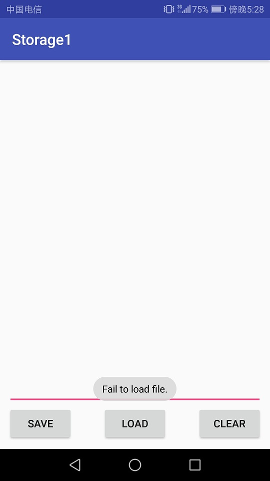 
- Figure 7：成功保存文件，弹出Toast提示。  
   
- Figure 8：成功导入文件，弹出Toast提示。  
  

### 验收内容
1. 布局显示与Figure 1 至 Figure 8一致。
2. 应用逻辑与上文描述一致。
   - 异常情况弹出Toast提示。
   - 创建密码后重新启动应用，直接显示单个输入框输入密码。
   - 文本编辑页面：能够正常保存和读取文件。
3. 在实验报告中简要描述Internal Storage和External Storage的区别，以及它们的适用场景。
4. 代码+实验报告（先在实验课上检查，检查后再pr）

---

## 三、实验结果
### (1)实验截图

以下图片全部为动图。

- 第一次打开应用：输入空密码；密码不一致；清空密码；成功注册

  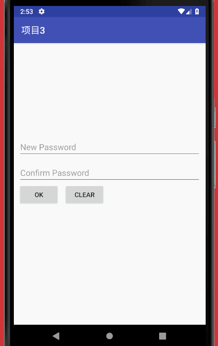

- 加载文件，加载失败

  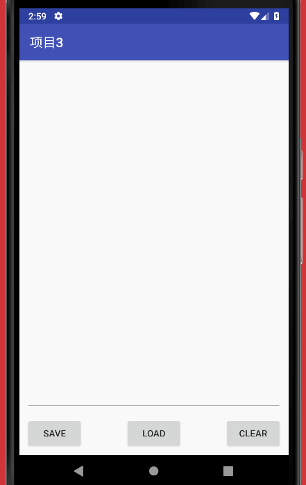

- 编辑文件；保存成功

  

- 清空编辑区；成功加载文件；点击返回按钮回到桌面

  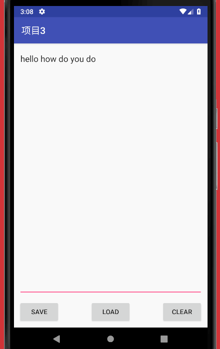

- 再次打开应用：输入错误密码；输入正确密码，成功登陆；成功加载文件

  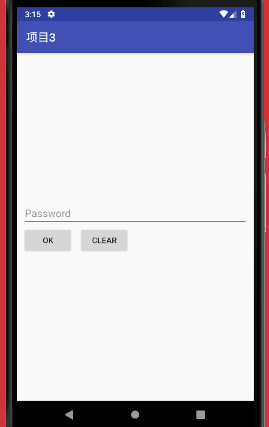

### (2)实验步骤以及关键代码

#### 登陆界面的布局

`avtivity_storage1_login.xml`

```xml
<?xml version="1.0" encoding="utf-8"?>
<android.support.constraint.ConstraintLayout xmlns:android="http://schemas.android.com/apk/res/android"
    xmlns:app="http://schemas.android.com/apk/res-auto"
    xmlns:tools="http://schemas.android.com/tools"
    android:layout_width="match_parent"
    android:layout_height="match_parent"
    tools:context=".Storage1LoginActivity">

    <EditText
        android:id="@+id/newPassword"
        android:layout_width="match_parent"
        android:layout_height="wrap_content"
        android:inputType="textPassword"
        android:hint="New Password"
        android:layout_marginTop="200dp"
        android:layout_marginHorizontal="10dp"
        app:layout_constraintTop_toTopOf="parent" />
    <EditText
        android:id="@+id/confirmPassword"
        android:layout_width="match_parent"
        android:layout_height="wrap_content"
        android:inputType="textPassword"
        android:hint="Confirm Password"
        android:layout_margin="10dp"
        app:layout_constraintTop_toBottomOf="@id/newPassword"/>
    <Button
        android:id="@+id/login"
        android:layout_width="wrap_content"
        android:layout_height="wrap_content"
        android:text="OK"
        android:onClick="onLoginClick"
        android:layout_marginHorizontal="10dp"
        app:layout_constraintTop_toBottomOf="@id/confirmPassword"
        app:layout_constraintLeft_toLeftOf="parent"/>
    <Button
        android:id="@+id/clear"
        android:layout_width="wrap_content"
        android:layout_height="wrap_content"
        android:text="CLEAR"
        android:onClick="onClearClick"
        android:layout_marginHorizontal="10dp"
        app:layout_constraintTop_toBottomOf="@id/confirmPassword"
        app:layout_constraintLeft_toRightOf="@id/login"/>

</android.support.constraint.ConstraintLayout>
```

#### 判断是否首次登陆，改变布局

`Storage1LoginActivity.java`

```java
    @Override
    protected void onCreate(Bundle savedInstanceState) {
        // ...

        String password = getSharedPreferences("MyPreference", Context.MODE_PRIVATE).getString("password", "");
        if(password != "") {
            // 不是首次登陆，所以改变界面显示
            newPassword.setVisibility(View.INVISIBLE);
            confirmPassword.setHint("Password");
        }
    }
```

#### 注册/登陆

`Storage1LoginActivity.java`，OK按钮的点击事件

```java
    public void onLoginClick(View view) {
        String password = getSharedPreferences("MyPreference", Context.MODE_PRIVATE).getString("password", "");
        if(password == "") {
            // 首次登陆
            if(TextUtils.isEmpty(newPassword.getText().toString())) {
                Toast.makeText(Storage1LoginActivity.this, "Password cannot be empty.", Toast.LENGTH_SHORT).show();
            }
            else if(!confirmPassword.getText().toString().equals(newPassword.getText().toString())) {
                Toast.makeText(Storage1LoginActivity.this, "Password Mismatch.", Toast.LENGTH_SHORT).show();
            }
            else {
                // 保存密码并登陆
                Context context = Storage1LoginActivity.this;
                SharedPreferences sharedPreferences = context.getSharedPreferences("MyPreference", Context.MODE_PRIVATE);
                SharedPreferences.Editor editor = sharedPreferences.edit();
                editor.putString("password", newPassword.getText().toString());
                editor.commit();
                Intent intent = new Intent(Storage1LoginActivity.this, Storage1NoteActivity.class);
                startActivity(intent);
            }
        }
        else if(!password.equals(confirmPassword.getText().toString())){
            Toast.makeText(Storage1LoginActivity.this, "Invalid Password.", Toast.LENGTH_SHORT).show();
        }
        else {
            Intent intent = new Intent(Storage1LoginActivity.this, Storage1NoteActivity.class);
            startActivity(intent);
        }
    }
```

#### 清空密码框

`Storage1LoginActivity.java`，CLEAR按钮的点击事件

```java
    public void onClearClick(View view) {
        newPassword.setText("");
        confirmPassword.setText("");
    }
```

#### 文件编辑界面的布局

`activity_storage1_note.xml`

```xml
<?xml version="1.0" encoding="utf-8"?>
<android.support.constraint.ConstraintLayout xmlns:android="http://schemas.android.com/apk/res/android"
    xmlns:app="http://schemas.android.com/apk/res-auto"
    xmlns:tools="http://schemas.android.com/tools"
    android:layout_width="match_parent"
    android:layout_height="match_parent"
    tools:context=".Storage1NoteActivity">

    <EditText
        android:id="@+id/fileText"
        android:layout_width="match_parent"
        android:layout_height="0dp"
        android:gravity="top|left"
        android:layout_margin="10dp"
        app:layout_constraintTop_toTopOf="parent"
        app:layout_constraintBottom_toTopOf="@id/load"/>

    <Button
        android:id="@+id/save"
        android:layout_width="wrap_content"
        android:layout_height="wrap_content"
        android:text="SAVE"
        android:layout_marginHorizontal="10dp"
        android:layout_marginBottom="10dp"
        android:onClick="onSaveClick"
        app:layout_constraintLeft_toLeftOf="parent"
        app:layout_constraintBottom_toBottomOf="parent"/>

    <Button
        android:id="@+id/load"
        android:layout_width="wrap_content"
        android:layout_height="wrap_content"
        android:text="LOAD"
        android:layout_marginHorizontal="10dp"
        android:layout_marginBottom="10dp"
        android:onClick="onLoadClick"
        app:layout_constraintLeft_toLeftOf="parent"
        app:layout_constraintRight_toRightOf="parent"
        app:layout_constraintBottom_toBottomOf="parent"/>

    <Button
        android:id="@+id/clear"
        android:layout_width="wrap_content"
        android:layout_height="wrap_content"
        android:text="CLEAR"
        android:layout_marginHorizontal="10dp"
        android:layout_marginBottom="10dp"
        android:onClick="onClearClick"
        app:layout_constraintRight_toRightOf="parent"
        app:layout_constraintBottom_toBottomOf="parent"/>

</android.support.constraint.ConstraintLayout>
```

#### 保存文件

`Storage1NoteActivity.java`，SAVE按钮的点击事件

```java
    public void onSaveClick(View view) {
        try (FileOutputStream fileOutputStream = openFileOutput(getString(R.string.file_name), MODE_PRIVATE)) {
            fileOutputStream.write(fileText.getText().toString().getBytes());
            Toast.makeText(Storage1NoteActivity.this, "Save successfully.", Toast.LENGTH_SHORT).show();
        } catch (IOException e) {
            Toast.makeText(Storage1NoteActivity.this, "Fail to save file.", Toast.LENGTH_SHORT).show();
        }
    }
```

#### 加载文件

`Storage1NoteActivity.java`，LOAD按钮的点击事件

```java
    public void onLoadClick(View view) {
        try (FileInputStream fileInputStream = openFileInput(getString(R.string.file_name))) {
            byte[] contents = new byte[fileInputStream.available()];
            fileInputStream.read(contents);
            String text = new String(contents);
            fileText.setText(text);
            Toast.makeText(Storage1NoteActivity.this, "Load successfully.", Toast.LENGTH_SHORT).show();
        } catch (IOException e) {
            Toast.makeText(Storage1NoteActivity.this, "Fail to load file.", Toast.LENGTH_SHORT).show();
        }
    }
```

#### 清空文本编辑区

`Storage1NoteActivity.java`，CLEAR按钮的点击事件

```java
    public void onClearClick(View view) {
        fileText.setText("");
    }
```

### (3)实验遇到的困难以及解决思路

- **在文件编辑界面的布局，要让文本编辑区填满按钮上方，并且按钮水平均匀排列。**

为了让3个按钮水平均匀排列，设置LOAD按钮居中，SAVE按钮的左边约束到父布局的左边，CLEAR按钮的右边约束到父布局的右边，并且它们的底部都约束到父布局的底部：

```xml
<Button
    android:id="@+id/save"
    app:layout_constraintLeft_toLeftOf="parent"
    app:layout_constraintBottom_toBottomOf="parent"/>

<Button
    android:id="@+id/load"
    app:layout_constraintLeft_toLeftOf="parent"
    app:layout_constraintRight_toRightOf="parent"
    app:layout_constraintBottom_toBottomOf="parent"/>

<Button
    android:id="@+id/clear"
    app:layout_constraintRight_toRightOf="parent"
    app:layout_constraintBottom_toBottomOf="parent"/>
```

为了让文本编辑区能填满按钮上方的区域，使其顶部约束到父布局的顶部，底部约束到LOAD按钮的顶部，将 `height` 属性设为 `0dp`：

```xml
<EditText
    android:id="@+id/fileText"
    android:layout_width="match_parent"
    android:layout_height="0dp"
    app:layout_constraintTop_toTopOf="parent"
    app:layout_constraintBottom_toTopOf="@id/load"/>
```

## 四、实验思考及感想

1. 学习到了 `SharedPreferences` 的使用。它是安卓平台上一个轻量级的存储类，主要保存一些常用的配置信息，以键值对的形式存储。如果应用程序被卸载了，该应用使用的 `SharedPreferences` 也会被删除。

2. 初步了解了 `Internal Storage` 和 `External Storage` ，并实践了 `Internal Storage` 的使用。

   对 `Internal Storage` ，默认情况下，保存在 `Internal Storage` 的⽂件只有应⽤程序可⻅，其他应⽤，以及⽤⼾本⾝⽆法访问这些⽂件。诸如一些笔记、清单类型的应用会使用它来存放相关文件，卸载应用后这些文件也会被清除。

   而 `External Storage` 可用于存储公开的，或者体积较大的文件（如媒体文件）。比如一些修图应用，就使用 `External Storage` 来保存照片，以供用户查看和使用 。对它的读写使用Java的文件读写API来完成，并且需要在 `AndroidManifest.xml` 中声明相应的权限。

# 安卓开发实验报告（第11周）

（2018年秋季学期）

| 课程名称 | 手机平台应用开发 |   任课老师   |      郑贵锋      |
| :------: | :--------------: | :----------: | :--------------: |
|   年级   |       16级       | 专业（方向） | 软件工程（计应） |
|   学号   |     16340280     |     姓名     |      余漫霖      |
|   电话   |   15626273508    |    Email     | 624275782@qq.com |
| 开始日期 |    2018/10/31    |   完成日期   |    2018/11/21    |

---

## 一、实验题目

1. 学习SQLite数据库的使用。  
2. 学习ContentProvider的使用。
3. 复习Android界面编程。

---

## 二、实验内容

#### 要求

* #### 技术要求： 
    1. 使用SQLite数据库保存用户的相关信息和评论的相关信息，使得每次运行程序都可以使用数据库进行用户的登陆与注册，以及显示数据库中的评论；
    2. 使用ContentProvider来获取对应用户的电话号码；
* #### 功能要求：  
    1. 如图1至图8所示，本次实验演示应包含2个Activity。
    2. 首页Activity包含登录功能和注册功能，通过radioButton在两个页面进行切换,在登陆界面输入正确的用户名和密码后跳转到评论页面。
    3. 评论Activity,界面由ListView、EditText和Button组成，ListView中展示数据库中保存的评论信息，在EditText写评论，点击Send按钮发送评论。
    4. 首页Activity：
        * 应用启动时，界面初始化为登录界面，通过Login和Register两个RadioButton进行登录与注册之间的切换。
        * 点击Login切换到登录界面（见图1.1），可以保留注册界面时的Username，但不保存密码：
            - OK按钮点击后：
                + 若Username为空，则发出Toast提示。见图1.2.
                + 若Password为空，则发出Toast提示。见图1.3.
                + 若Username不存在，则发出Toast提示。见图1.4.
                + 若密码不正确，则发出Toast提示。见图1.5.
            - CLEAR按钮点击后：清除两个输入框的内容。
        * 点击Register切换到注册页面（见图2.1），可以保留登录界面时的Username，但不保存密码，在输入框和RadioButto之间存在一个头像ImageView，水平居中：
            - OK按钮点击后：
                + 若Username为空，则发出Toast提示。见图2.2.
                + 若New Password为空，则发出Toast提示。见图2.3.
                + 若New Password与Confirm Password不匹配，则发出Toast提示。见图2.4.
                + 若Username已经存在，则发出Toast提示。见图2.5. 
            - CLEAR按钮点击后：清除三个输入框的内容。
    5. 评论页面：
        * 界面底部有一个EditText和一个按钮，高度一致，EditText占据按钮左边的全部空间。上方的全部剩余空间由一个ListView占据（保留margin）。见图3.1.
        * ListView中的每条Item，包含了头像、点赞按钮这两个ImageView和用户名、评论时间、评论内容、点赞数这4个TextView。
            - 用户名、评论时间、评论内容在头像的右边。
            - 点赞按钮在Item的最右边，而且在用户名+评论时间的总高度上处于竖直方向上居中，**注意：总高度不包括评论占据的高度**
            - 点赞数在点赞按钮的左边，竖直方向居中要求同点赞按钮。
            - **以下样式供参考，不做强制要求，但要求至少美观：**
                + Item整体margin：10dp，
                + 头像width、hight：40sp，
                + 用户名textColor：#7a7a7a、textSize：20sp
                + 评论时间textColor：#7a7a7a、textSize：10sp
                + 评论textColor：#3e3e3e、textSize：20sp
                + 点赞数textSize：15sp 
        * 点击EditText写评论
        * 点击Send按钮发送评论
            - 若EditText为空，则发出Toast提示。如图3.2.
            - 若EditText不为空，则发送评论，在数据库和ListView中添加新评论。
        * ListView中的Item点击事件：
            - 短按评论：弹出对话框，显示该评论的用户以及通讯录中该用户的电话号码。如图3.3和图3.4.
            - 长按评论：
                + 若该评论为当前用户发送的，弹出是否删除的对话框,若选择了Yes，则删除该条评论并更新数据库和ListView。如图3.5.
                + 若该评论不为当前用户发送的，弹出是否举报的对话框，若选择了Yes，则弹出Toast提示，不需做任何数据库和ListView的更改。如图3.6.

    **附加内容（加分项，本次实验与（一）合计100分，加分项每项占10分）**

    1. **头像**
        在用户注册页面可以选择用户头像，ImageView初始化为图add，如图2.1。点击ImageView，进入手机图库进行图片选择。如图4.1.
        * 如果正确选择了一张图片，则ImageView显示本次选择的图片。如图4.2.
        * 如果没有正确选择图片（如在图片选择页面点击了取消或按了手机的BACK键），则ImageView保留本次点击事件发生前的状态，如初始的＋号图片，如图4.1，或者是上一个被正确选择的图像。如图4.2.
          在评论页面，每条Item应当正确显示用户的头像，如果用户没有在注册页面选择头像，则使用默认头像。如图4.3.
    2. **点赞**
      在评论界面，点赞按钮可以被点击，点赞数可以正常统计，用户点赞状态可以被正常记录，白色的未点赞状态经用户点击后变为红色的点赞状态，点赞数加1；再次点击点赞按钮可取消点赞，点赞数减1.要求用数据库记录点赞的信息，使得应用重启后用户的点赞状态，评论的点赞数可以正常显示，注意：用户的对每条评论的点赞状态是唯一的，即不同用户对每条评论的点赞状态应当分开记录，同一用户对不同评论的点赞状态也应当分开记录。同理，每条评论的点赞数也应当分开记录。请参考demo自行体会。

    **对附加内容的补充（不想做加分项的看这里）**

    1. **头像**
        在用户注册页面的ImageView显示为默认头像，且不需要添加任何的点击事件监听器，在评论页面的用户头像也使用默认头像。
    2. **点赞**
        不需要为点赞按钮添加点击事件监听器，关于点赞状态和点赞数使用随机数进行生成即可，也不要求用数据库记录点赞状态和点赞数。  

    3. **虽然点击事件的逻辑可以不做，但是界面的样式是必须按照前文做的！**


#### 验收内容
1. 布局显示上文描述一致。
2. 应用逻辑与上文描述一致。
3. 在实验报告中写明本次实验的数据库中全部的表的信息，以及重要的SQL语句（如创建、查询、插入、删除等），对完成加分项的同学要额外写明如何用数据库存头像，如何设计评论与用户之间点赞关系的关联表。
4. 完成加分项“点赞”的同学在实验报告中写明如何实现的点击事件，以及点赞状态和点赞数是如何获取的。
5. 代码+实验报告（先在实验课上检查，检查后再pr）

---

## 三、实验结果
### (1)实验截图

- Amy登录：用户名不能为空；密码不能为空；用户名不存在，登录失败

  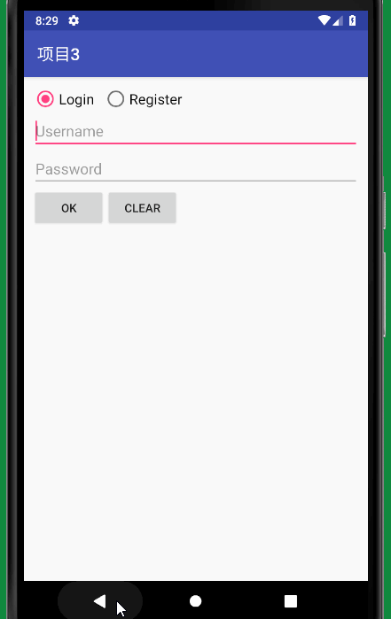

- Amy注册：用户名不能为空；密码不能为空；密码不一致；不选择新头像，Amy注册成功

  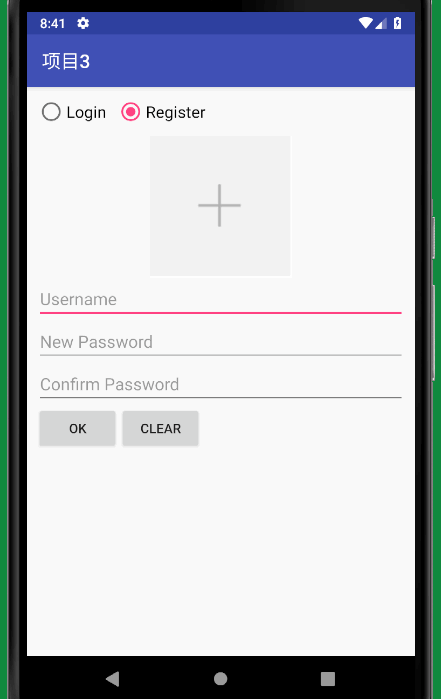

- Amy登录：密码错误；清空输入框；Amy登录成功

  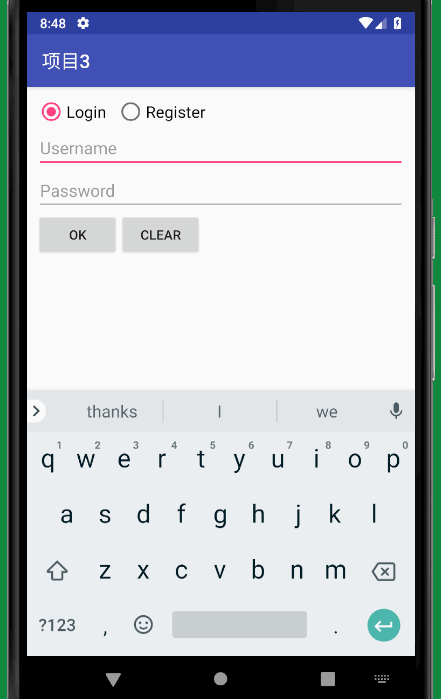

- Amy发送空评论，发送失败；发送两条非空评论，发送成功，可见Amy的默认头像

  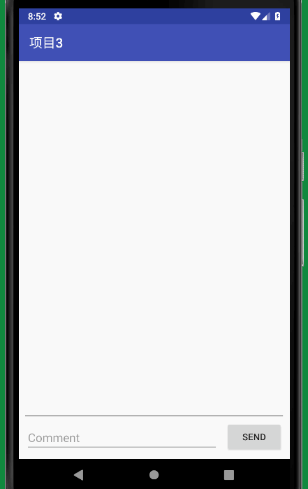

- Bob注册：使用用户名Amy注册，用户名已存在，注册失败；选择新头像，Bob注册成功；Bob登录，看到Amy的两条评论

  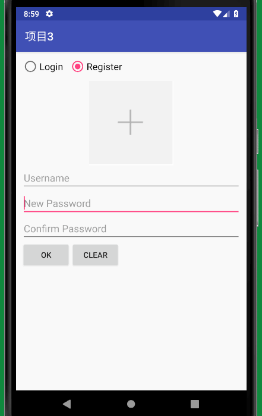

- Bob发送两条非空评论，可见Bob的自定义头像；Bob举报Amy的comment 1；Bob删除自己的comment 3

  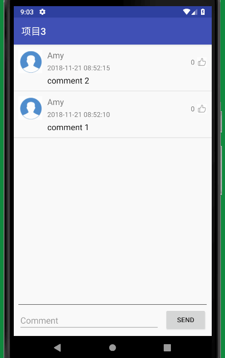

- 点击Amy的评论，告知无法查询电话号码，请检查读取通讯录的权限是否开启；开启通讯录权限后，点击Amy的评论，看到Amy的两个电话号码；点击Bob的评论，看到Bob没有电话号码

  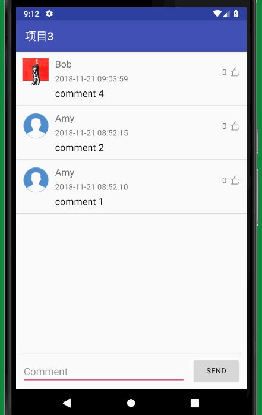

- Bob点赞Amy的comment 2，点赞Bob的comment 4；返回登录界面，Amy登录，点赞Bob的comment 4

  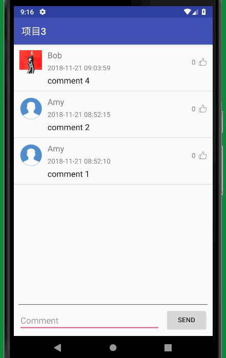

- 关闭应用后重新打开，Amy登录，可以看到自己点赞了comment 4；Bob登录，可以看到自己点赞了comment 2 和comment 4

  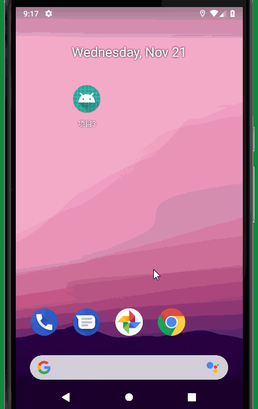

### (2)实验步骤以及关键代码

#### 应用状态

```java
public class Storage2Status {
    public static User currentUser; // 记录当前用户
}
```

#### 用户的数据模型User及数据库处理

用户模型User包括以下成员：

| 成员                     | 代码表示                | 在数据库中的存储类型                                    |
| ------------------------ | ----------------------- | ------------------------------------------------------- |
| 用户名                   | `String username`       | `TEXT` 主键                                             |
| 密码                     | `String password`       | `TEXT`                                                  |
| 头像                     | `Bitmap avatar`         | `BLOB`                                                  |
| 用户点赞的评论的id的集合 | `ArrayList<Long> likes` | `TEXT`以字符串的形式存储，类似于 `"id_1,id_2,...,id_n"` |

以下是 `User` 的代码定义：

```java
public class User {
    private String username;
    private String password;
    private Bitmap avatar;
    private ArrayList<Long> likes;  // 记录用户点赞的评论的id集合

    public User(String username, String password, Bitmap avatar, ArrayList<Long> likes) {
        this.username = username;
        this.password = password;
        this.avatar = avatar;
        if(likes == null) this.likes = new ArrayList<>();
        else this.likes = likes;
    }

    public User(String username, String password, Bitmap avatar, String likes) {
        this.username = username;
        this.password = password;
        this.avatar = avatar;
        this.likes = new ArrayList<>();
        if(!likes.isEmpty()) {
            String[] strlikes = likes.split(",");
            for (String str : strlikes) {
                this.likes.add(Long.valueOf(str));
            }
        }
    }

    public String getUsername() {
        return username;
    }

    public String getPassword() {
        return password;
    }

    public Bitmap getAvatar() {
        return avatar;
    }

    public String getLikes() {  // 将点赞评论的id集合转换成字符串，供数据库存储
        String strlikes = "";
        for (Long l : likes) {
            strlikes = strlikes + ",";
            strlikes = strlikes + Long.toString(l);
        }
        if(strlikes.isEmpty()) return strlikes;
        else return strlikes.substring(1);
    }

    // ...
}

```

在自定义的数据库处理类中，这样处理用户：

```java
public class DB extends SQLiteOpenHelper {
    // ...
    
    private static final String USERS_TABLE = "user";
    
    // ...

    @Override
    public void onCreate(SQLiteDatabase db) {
        // 创建用户表
        String CREATE_USERS_TABLE = "CREATE TABLE if not exists "
                + USERS_TABLE
                + " (username TEXT PRIMARY KEY, password TEXT, likes TEXT, avatar BLOB)";
        db.execSQL(CREATE_USERS_TABLE);
		// ...
    }

    // ...

    // 由用户名获取用户
    public User getUser(String username) {
        SQLiteDatabase db = getReadableDatabase();
        Cursor cursor = db.query(USERS_TABLE, new String[]{"username","password", "avatar", "likes"},
                "username=?", new String[]{username}, null, null, null);

        if(!cursor.moveToFirst()) return null;

        String password = cursor.getString(cursor.getColumnIndex("password"));
        String likes = cursor.getString(cursor.getColumnIndex("likes"));
        byte[] blob = cursor.getBlob(cursor.getColumnIndex("avatar"));
        Bitmap avatar = BitmapFactory.decodeByteArray(blob, 0, blob.length);

        db.close();

        return new User(username, password, avatar, likes);
    }

    // 插入新用户
    public void insertUser(User user) {
        SQLiteDatabase db = getWritableDatabase();
        ContentValues cv = new ContentValues();
        cv.put("username", user.getUsername());
        cv.put("password", user.getPassword());

        // 数据库存储头像
        final ByteArrayOutputStream os = new ByteArrayOutputStream();
        user.getAvatar().compress(Bitmap.CompressFormat.PNG, 100, os);
        cv.put("avatar", os.toByteArray());

        cv.put("likes", user.getLikes());
        db.insert(USERS_TABLE, null, cv);
        db.close();
    }

    // 修改当前用户所点赞的评论
    public void updateUser(User user) {
        SQLiteDatabase db = getWritableDatabase();
        ContentValues cv = new ContentValues();
        cv.put("likes", user.getLikes());

        String whereClause = "username=?";
        String[] whereArgs = {user.getUsername()};
        db.update(USERS_TABLE, cv, whereClause, whereArgs);
        db.close();
    }
}

```

#### 评论的数据模型Comment及数据库处理

| 成员     | 代码表示          | 在数据库中的存储类型                                         |
| -------- | ----------------- | ------------------------------------------------------------ |
| 评论ID   | `long id`         | `INTEGER` 主键，由数据库插入新记录时自增生成，向数据库插入评论时会返回生成的id。 |
| 用户名   | `String username` | `TEXT`                                                       |
| 评论内容 | `String content`  | `TEXT`                                                       |
| 发表时间 | `Date date`       | `INTEGER` 向数据库插入评论记录前，先转换为 `long` 类型的时间戳。 |
| 点赞数   | `int likenum`     | `INTEGER`                                                    |
| 用户头像 | `Bitmap avatar`   | 不存储在数据库的评论表中。应用初始化时，根据每条评论的用户名从数据库的用户表中获取用户头像。 |

以下是 `Comment` 的代码定义：

```java
public class Comment {
    private long id;
    private String username;
    private String content;
    private Date date;
    private int likenum;
    private Bitmap avatar;

    public Comment(long id, String username, String content, Date date, int likenum, Bitmap avatar) {
        this.id = id;
        this.username = username;
        this.content = content;
        this.date = date;
        this.likenum = likenum;
        this.avatar = avatar;
    }

    public Comment(String username, String content, Date date, int likenum, Bitmap avatar) {
        this.username = username;
        this.content = content;
        this.date = date;
        this.likenum = likenum;
        this.avatar = avatar;
    }

    public long getId() {
        return id;
    }

    public String getUsername() {
        return username;
    }

    public String getContent() {
        return content;
    }

    public String getFormattedDate() {	// 供UI显示格式化的日期
        SimpleDateFormat formatter = new SimpleDateFormat("yyyy-MM-dd HH:mm:ss");
        return formatter.format(date);
    }

    public Bitmap getAvatar() {
        return avatar;
    }

    public int getLikenum() {
        return likenum;
    }

    public long getTimestamp() {	// 转换为时间戳存入数据库
        return date.getTime();
    }

    public void setId(long id){
        this.id = id;
    }

    // ...
}

```

在自定义的数据库处理类中，这样处理评论：

```java
public class DB extends SQLiteOpenHelper {
    //...
    
    private static final String COMMENTS_TABLE = "comment";
    
    // ...

    @Override
    public void onCreate(SQLiteDatabase db) {
        // ...

        // 创建评论表
        String CREATE_COMMENTS_TABLE = "CREATE TABLE if not exists "
                + COMMENTS_TABLE
                + " (id INTEGER PRIMARY KEY, username TEXT, content TEXT, date INTEGER, likenum INTEGER)";
        db.execSQL(CREATE_COMMENTS_TABLE);
    }

    // ...

    // 获取所有评论
    public ArrayList<Comment> getComments() {
        SQLiteDatabase db = getReadableDatabase();
        Cursor cursor = db.query(COMMENTS_TABLE, new String[]{"id","username", "content", "date", "likenum"},
                null, null, null, null, null);

        ArrayList<Comment> comments = new ArrayList<>();

        while(cursor.moveToNext()){
            long id = cursor.getLong(cursor.getColumnIndex("id"));
            String username = cursor.getString(cursor.getColumnIndex("username"));
            String content = cursor.getString(cursor.getColumnIndex("content"));
            long timestamp = cursor.getLong(cursor.getColumnIndex("date"));
            int likenum = cursor.getInt(cursor.getColumnIndex("likenum"));

            // 从用户表中根据用户名获取头像
            Cursor cursorAvatar = db.query(USERS_TABLE, new String[]{"username", "avatar"},
                    "username=?", new String[]{username}, null, null, null);
            cursorAvatar.moveToFirst();
            byte[] blob = cursorAvatar.getBlob(cursorAvatar.getColumnIndex("avatar"));
            Bitmap avatar = BitmapFactory.decodeByteArray(blob, 0, blob.length);

            comments.add(0, new Comment(id, username, content, new Date(timestamp), likenum, avatar));
        }

        db.close();

        return comments;
    }

    // 插入新评论，返回该评论的id
    public long insertComment(Comment comment) {
        SQLiteDatabase db = getWritableDatabase();
        ContentValues cv = new ContentValues();
        Integer nullid = null;
        cv.put("id", nullid);
        cv.put("username", comment.getUsername());
        cv.put("content", comment.getContent());
        cv.put("date", comment.getTimestamp());
        cv.put("likenum", comment.getLikenum());

        long id = db.insert(COMMENTS_TABLE, null, cv);
        db.close();

        return id;
    }

    // 修改该评论的点赞数
    public void updateComment(Comment comment) {
        SQLiteDatabase db = getWritableDatabase();
        ContentValues cv = new ContentValues();
        cv.put("likenum", comment.getLikenum());

        String whereClause = "id=?";
        String[] whereArgs = new String[]{Long.toString(comment.getId())};
        db.update(COMMENTS_TABLE, cv, whereClause, whereArgs);
        db.close();
    }

    // 删除评论
    public void deleteComment(long commentID) {
        SQLiteDatabase db = getWritableDatabase();

        String whereClause = "id=?";
        String[] whereArgs = new String[]{Long.toString(commentID)};
        db.delete(COMMENTS_TABLE, whereClause, whereArgs);
        db.close();
    }
}

```

#### 登陆/注册界面的布局

`activity_storage2_login.xml`

```xml
<?xml version="1.0" encoding="utf-8"?>
<android.support.constraint.ConstraintLayout xmlns:android="http://schemas.android.com/apk/res/android"
    xmlns:app="http://schemas.android.com/apk/res-auto"
    xmlns:tools="http://schemas.android.com/tools"
    android:layout_width="match_parent"
    android:layout_height="match_parent"
    tools:context=".Storage2LoginActivity">

    <RadioGroup
        android:id="@+id/switchEntry"
        android:layout_width="wrap_content"
        android:layout_height="wrap_content"
        android:checkedButton="@id/login"
        android:orientation="horizontal"
        android:layout_marginTop="10dp"
        android:layout_marginHorizontal="10dp"
        app:layout_constraintTop_toTopOf="parent"
        app:layout_constraintLeft_toLeftOf="parent">
        <RadioButton
            android:id="@+id/login"
            android:layout_width="wrap_content"
            android:layout_height="wrap_content"
            android:text="Login"
            android:textSize="17sp"
            android:layout_marginRight="10dp"/>
        <RadioButton
            android:id="@+id/register"
            android:layout_width="wrap_content"
            android:layout_height="wrap_content"
            android:text="Register"
            android:textSize="17sp"/>
    </RadioGroup>

    <ImageButton
        android:id="@+id/newAvatar"
        android:layout_width="150dp"
        android:layout_height="150dp"
        android:visibility="gone"
        android:background="@mipmap/add"
        android:onClick="loadPicture"
        android:layout_margin="10dp"
        app:layout_constraintLeft_toLeftOf="parent"
        app:layout_constraintRight_toRightOf="parent"
        app:layout_constraintTop_toBottomOf="@id/switchEntry"/>
    
    <EditText
        android:id="@+id/username"
        android:layout_width="match_parent"
        android:layout_height="wrap_content"
        android:hint="Username"
        android:layout_marginHorizontal="10dp"
        app:layout_constraintTop_toBottomOf="@id/newAvatar"/>

    <EditText
        android:id="@+id/newPassword"
        android:layout_width="match_parent"
        android:layout_height="wrap_content"
        android:inputType="textPassword"
        android:hint="Password"
        android:layout_marginHorizontal="10dp"
        app:layout_constraintTop_toBottomOf="@id/username" />

    <EditText
        android:id="@+id/confirmPassword"
        android:layout_width="match_parent"
        android:layout_height="wrap_content"
        android:inputType="textPassword"
        android:hint="Confirm Password"
        android:visibility="gone"
        android:layout_marginHorizontal="10dp"
        android:layout_marginBottom="10dp"
        app:layout_constraintTop_toBottomOf="@id/newPassword" />

    <Button
        android:id="@+id/ok"
        android:layout_width="wrap_content"
        android:layout_height="wrap_content"
        android:text="OK"
        android:onClick="onOkClick"
        android:layout_marginHorizontal="10dp"
        app:layout_constraintTop_toBottomOf="@id/confirmPassword"
        app:layout_constraintLeft_toLeftOf="parent"/>

    <Button
        android:id="@+id/clear"
        android:layout_width="wrap_content"
        android:layout_height="wrap_content"
        android:text="CLEAR"
        android:onClick="onClearClick"
        app:layout_constraintTop_toBottomOf="@id/confirmPassword"
        app:layout_constraintLeft_toRightOf="@id/ok"/>

</android.support.constraint.ConstraintLayout>
```

#### 登陆/注册的Activity

```java
public class Storage2LoginActivity extends AppCompatActivity {
    private RadioGroup switchEntry;
    private EditText username;
    private ImageButton newAvatar;
    private EditText newPassword;
    private EditText confirmPassword;
    private Bitmap avatar;
    @Override
    protected void onCreate(Bundle savedInstanceState) {
        super.onCreate(savedInstanceState);
        setContentView(R.layout.activity_storage2_login);

        switchEntry = findViewById(R.id.switchEntry);
        username = findViewById(R.id.username);
        newAvatar = findViewById(R.id.newAvatar);
        newPassword = findViewById(R.id.newPassword);
        confirmPassword = findViewById(R.id.confirmPassword);
        avatar = ((BitmapDrawable)getDrawable(R.mipmap.me)).getBitmap();	// 将avatar初始化为默认头像

        switchEntry.setOnCheckedChangeListener(new RadioGroup.OnCheckedChangeListener() {
            @Override
            public void onCheckedChanged(RadioGroup group, int checkedId) {
                int checked = switchEntry.getCheckedRadioButtonId();
                if(checked == R.id.login) {
                    newAvatar.setVisibility(View.GONE);
                    newPassword.setHint("Password");
                    confirmPassword.setVisibility(View.GONE);
                }
                else {
                    newAvatar.setVisibility(View.VISIBLE);
                    newPassword.setHint("New Password");
                    confirmPassword.setVisibility(View.VISIBLE);
                }
                clearUI();
            }
        });
    }

    // 处理从图库选择的图片，确定新头像
    @Override
    protected void onActivityResult(int requestCode, int resultCode, Intent data) {
        try{
            if (data != null) {
                Uri uri = data.getData();
                avatar = MediaStore.Images.Media.getBitmap(this.getContentResolver(), uri);
                avatar = ThumbnailUtils.extractThumbnail(avatar, 150, 150, ThumbnailUtils.OPTIONS_RECYCLE_INPUT);
                newAvatar.setBackground(new BitmapDrawable(getResources(), avatar));
            }
            super.onActivityResult(requestCode, resultCode, data);
        } catch (IOException e) {
            e.printStackTrace();
        }
    }

    // 从手机图库读取图片
    public void loadPicture(View view) {
        Intent intent = new Intent();
        intent.setAction(Intent.ACTION_PICK);
        intent.setType("image/*");
        startActivityForResult(intent, 0);
    }

    // OK按钮的点击事件：登录/注册
    public void onOkClick(View view) {
        DB db = DB.getInstance(Storage2LoginActivity.this);
        String name = username.getText().toString();
        String pw = newPassword.getText().toString();

        if(TextUtils.isEmpty(name)) {
            Toast.makeText(Storage2LoginActivity.this, "Username can't be empty.", Toast.LENGTH_SHORT).show();
            return;
        }
        if(TextUtils.isEmpty(pw)) {
            Toast.makeText(Storage2LoginActivity.this, "Password can't be empty.", Toast.LENGTH_SHORT).show();
            return;
        }

        User user = db.getUser(name);
        if(switchEntry.getCheckedRadioButtonId() == R.id.register) {    // 注册
            if(!confirmPassword.getText().toString().equals(pw)) {
                // 注册失败，密码不一致
                Toast.makeText(Storage2LoginActivity.this, "Password Mismatch.", Toast.LENGTH_SHORT).show();
                return;
            }
            if(user == null){
                // 注册成功
                user = new User(name, pw, avatar, new ArrayList<Long>());
                db.insertUser(user);
                Storage2Status.currentUser = user;
                Toast.makeText(Storage2LoginActivity.this, "Register successfully.", Toast.LENGTH_SHORT).show();
            }
            else{
                // 注册失败，用户名已存在
                Toast.makeText(Storage2LoginActivity.this, "Username exists.", Toast.LENGTH_SHORT).show();
            }
        }
        else {  // 登录
            if(user == null){
                // 登录失败，用户名不存在
                Toast.makeText(Storage2LoginActivity.this, "Username doesn't exist.", Toast.LENGTH_SHORT).show();
            }
            else if(!pw.equals(user.getPassword())){
                // 登录失败，密码不正确
                Toast.makeText(Storage2LoginActivity.this, "Invalid password.", Toast.LENGTH_SHORT).show();
            }
            else{
                // 登录成功
                Storage2Status.currentUser = user;
                clearUI();

                // 跳转到评论页面
                Intent intent = new Intent(Storage2LoginActivity.this, Storage2CommentsActivity.class);
                startActivity(intent);
            }
        }
    }

    // CLEAR按钮的点击事件：清空输入框
    public void onClearClick(View view) {
        username.setText("");
        newPassword.setText("");
        confirmPassword.setText("");
    }

    // 清空登陆/注册界面
    private void clearUI() {
        username.setText("");
        newPassword.setText("");
        confirmPassword.setText("");
        newAvatar.setBackground(getDrawable(R.mipmap.add));
    }
}

```

#### 评论界面的布局

`activity_storage2_comments.xml`

其中， `View split` 是评论列表视图与评论编辑区的分割线。

```xml
<?xml version="1.0" encoding="utf-8"?>
<android.support.constraint.ConstraintLayout xmlns:android="http://schemas.android.com/apk/res/android"
    xmlns:app="http://schemas.android.com/apk/res-auto"
    xmlns:tools="http://schemas.android.com/tools"
    android:layout_width="match_parent"
    android:layout_height="match_parent"
    tools:context=".Storage2CommentsActivity">

    <ListView
        android:id="@+id/comments"
        android:layout_width="match_parent"
        android:layout_height="0dp"
        android:layout_marginBottom="10dp"
        app:layout_constraintTop_toTopOf="parent"
        app:layout_constraintLeft_toLeftOf="parent"
        app:layout_constraintRight_toRightOf="parent"
        app:layout_constraintBottom_toTopOf="@id/split"/>

    <View
        android:id="@+id/split"
        android:layout_width="match_parent"
        android:layout_height="0.5dp"
        android:background="#505050"
        android:layout_marginHorizontal="10dp"
        android:layout_marginBottom="10dp"
        app:layout_constraintBottom_toTopOf="@id/edit"/>

    <EditText
        android:id="@+id/edit"
        android:layout_width="0dp"
        android:layout_height="wrap_content"
        android:hint="Comment"
        android:layout_margin="10dp"
        app:layout_constraintLeft_toLeftOf="parent"
        app:layout_constraintRight_toLeftOf="@id/send"
        app:layout_constraintBottom_toBottomOf="parent"/>

    <Button
        android:id="@+id/send"
        android:layout_width="wrap_content"
        android:layout_height="wrap_content"
        android:text="send"
        android:onClick="onSendClick"
        android:layout_marginVertical="10dp"
        android:layout_marginEnd="10dp"
        app:layout_constraintRight_toRightOf="parent"
        app:layout_constraintBottom_toBottomOf="parent"
        app:layout_constraintLeft_toRightOf="@id/edit"/>

</android.support.constraint.ConstraintLayout>
```

#### 评论列表项的布局

`item_storage2_comment.xml`

其中， 用户名 `username` ，发表日期 `date` ，点赞数 `likenum` ，点赞按钮 `like` ，都在一个相对布局 `header` 里。这样是为了使点赞数和点赞按钮处于用户名、日期的总的高度的垂直居中位置。

```xml
<?xml version="1.0" encoding="utf-8"?>
<RelativeLayout xmlns:android="http://schemas.android.com/apk/res/android"
    android:layout_height="wrap_content"
    android:layout_width="wrap_content"
    android:descendantFocusability="blocksDescendants"
    android:padding="10dp">

    <ImageView
        android:id="@+id/avatar"
        android:layout_width="50dp"
        android:layout_height="50dp"
        android:layout_alignParentTop="true"
        android:layout_alignParentLeft="true"/>

    <RelativeLayout
        android:id="@+id/header"
        android:layout_width="wrap_content"
        android:layout_height="wrap_content"
        android:layout_toEndOf="@id/avatar">
        <TextView
            android:id="@+id/username"
            android:layout_width="wrap_content"
            android:layout_height="wrap_content"
            android:textSize="17sp"
            android:layout_marginHorizontal="10dp"
            android:layout_marginBottom="5dp"
            android:layout_alignParentTop="true"/>

        <TextView
            android:id="@+id/date"
            android:layout_width="wrap_content"
            android:layout_height="wrap_content"
            android:layout_marginHorizontal="10dp"
            android:layout_marginBottom="5dp"
            android:layout_below="@id/username"/>

        <TextView
            android:id="@+id/likenum"
            android:layout_width="wrap_content"
            android:layout_height="wrap_content"
            android:layout_marginEnd="5dp"
            android:layout_centerVertical="true"
            android:layout_toStartOf="@id/like"/>

        <ImageButton
            android:id="@+id/like"
            android:layout_width="20dp"
            android:layout_height="20dp"
            android:scaleType="fitCenter"
            android:background="@mipmap/white"
            android:layout_centerVertical="true"
            android:layout_alignParentRight="true"/>
    </RelativeLayout>

    <TextView
        android:id="@+id/content"
        android:layout_width="wrap_content"
        android:layout_height="wrap_content"
        android:textSize="17sp"
        android:textColor="#000000"
        android:layout_marginHorizontal="10dp"
        android:layout_below="@id/header"
        android:layout_toEndOf="@id/avatar"/>

</RelativeLayout>
```

#### 评论的Activity：发送评论

```java
public class Storage2CommentsActivity extends AppCompatActivity {

    private ListView comments;
    private Storage2CommentsAdapter commentsAdapter;
    private EditText edit;

    // ...
    
    // 发送评论
    public void onSendClick(View view) {
        if(TextUtils.isEmpty(edit.getText())) {
            // 评论为空，发送失败
            Toast.makeText(Storage2CommentsActivity.this, "Comment can't be empty.", Toast.LENGTH_SHORT).show();
            return;
        }
        User currentUser = Storage2Status.currentUser;
        Comment comment = new Comment(currentUser.getUsername(), edit.getText().toString(), new Date(), 0, currentUser.getAvatar());
        DB db = DB.getInstance(Storage2CommentsActivity.this);
        long id = db.insertComment(comment);
        comment.setId(id);
        commentsAdapter.add(comment);
        edit.setText("");
    }

}

```

#### 评论的Activity：点击评论列表项显示电话号码

```java
public class Storage2CommentsActivity extends AppCompatActivity {

    private ListView comments;
    private Storage2CommentsAdapter commentsAdapter;
    private EditText edit;

    @Override
    protected void onCreate(Bundle savedInstanceState) {
        // ...

        // 设置评论列表项的点击事件：显示评论用户和电话号码
        comments.setOnItemClickListener(new AdapterView.OnItemClickListener() {
            @Override
            public void onItemClick(AdapterView<?> parent, View view, int position, long id) {
                String message = "";
                Comment comment = (Comment) commentsAdapter.getItem(position);
                message += "Username:\t" + comment.getUsername() + "\n";

                try{
                    // 查询电话号码
                    Cursor cursor = getContentResolver().query(ContactsContract.CommonDataKinds.Phone.CONTENT_URI,
                            null,
                            ContactsContract.CommonDataKinds.Phone.DISPLAY_NAME + " = \"" + comment.getUsername() + "\"",
                            null, null);
                    if(cursor.moveToFirst()){
                        message += "Phone: ";
                        if(cursor.getCount() > 1) message += "\n";
                        do {
                            message += "\t\t" + cursor.getString(cursor.getColumnIndex(ContactsContract.CommonDataKinds.Phone.NUMBER)) + "\n";
                        } while (cursor.moveToNext());
                    }
                    else {
                        message += "Phone number does not exist.";
                    }
                } catch (SecurityException se) {
                    // 无法查询电话号码，提醒检查读取通讯录的权限
                    message += "Phone number can't be queried.\nPlease check if permission for reading contacts is granted.\n";
                }

                // 弹出消息框
                AlertDialog.Builder builder = new AlertDialog.Builder(Storage2CommentsActivity.this);
                builder.setTitle("Info");
                builder.setMessage(message);
                builder.setPositiveButton("OK", null);
                builder.show();
            }
        });

        // ...
    }

    // ...
}

```

#### 评论Activity：长按评论列表项举报/删除

```java
public class Storage2CommentsActivity extends AppCompatActivity {

    private ListView comments;
    private Storage2CommentsAdapter commentsAdapter;
    private EditText edit;

    @Override
    protected void onCreate(Bundle savedInstanceState) {
        // ...

        // 设置评论的长按事件：删除或举报评论
        comments.setOnItemLongClickListener(new AdapterView.OnItemLongClickListener() {
            @Override
            public boolean onItemLongClick(AdapterView<?> parent, View view, final int position, long id) {
                AlertDialog.Builder builder = new AlertDialog.Builder(Storage2CommentsActivity.this);

                final Comment comment = (Comment) commentsAdapter.getItem(position);
                if(Storage2Status.currentUser.getUsername().equals(comment.getUsername())){
                    // 删除自己的评论
                    builder.setTitle("Delete or not?");
                    builder.setPositiveButton("YES", new DialogInterface.OnClickListener() {
                        @Override
                        public void onClick(DialogInterface dialog, int which) {
                            DB db = DB.getInstance(Storage2CommentsActivity.this);
                            db.deleteComment(commentsAdapter.getItemId(position));
                            commentsAdapter.remove(position);
                        }
                    });
                    builder.setNegativeButton("NO", null);
                }
                else{
                    // 举报他人的评论
                    builder.setTitle("Report or not?");
                    builder.setPositiveButton("YES", new DialogInterface.OnClickListener() {
                        @Override
                        public void onClick(DialogInterface dialog, int which) {
                            Toast.makeText(Storage2CommentsActivity.this, "Already reported.", Toast.LENGTH_SHORT).show();
                        }
                    });
                    builder.setNegativeButton("NO", null);
                }

                builder.show();
                return true;
            }
        });
    }

    // ...

}

```

#### 评论列表视图的适配器：点赞状态显示和点赞事件

在 `User` 中定义了如下和点赞有关的成员和方法：

```java
public class User {
    // ...
    
    private ArrayList<Long> likes;  // 记录用户点赞的评论的id集合

    // ...
    
    public boolean whetherLike(long commentID) {    // 用户是否点赞了某条评论
        return likes.contains(commentID);
    }

    public void doLike(long commentID) {    // 用户点赞某条评论
        likes.add(commentID);
    }

    public void cancelLike(long commentID) {    // 用户取消点赞评论
        likes.remove(Long.valueOf(commentID));
    }
}

```

在 `Comment` 中定义了如下和点赞有关的成员和方法：

```java
public class Comment { 
    // ...
    
    private int likenum;	// 点赞数
    
    // ...
    
    public int getLikenum() {	// 获取点赞数
        return likenum;
    }

    // ...

    public void doLike() {	// 被点赞
        this.likenum++;
    }

    public void cancelLike() {	// 被取消点赞
        this.likenum--;
    }
}

```

在评论列表视图的适配器中，根据评论的点赞数，和当前用户是否点赞了该评论，控制点赞数和点赞按钮的显示。

并且为 `ImageButton like` 控件添加了点击事件，即点赞/取消点赞事件。在这个点击事件中，调用用户 `User` 的点赞/取消点赞方法、评论 `Comment` 的点赞/取消点赞方法，更新数据模型和UI；调用了数据库处理类 `DB` 的更新用户和更新评论方法，更新数据库存储。

```java
public class Storage2CommentsAdapter extends BaseAdapter {
    private ArrayList<Comment> comments;
    private Context context;

    // ...
    
    @Override
    public View getView(int position, View convertView, ViewGroup parent) {
        // ...
        
        // 获取评论点赞数
        viewHolder.likenum.setText(Integer.toString(comment.getLikenum()));
        
        // 获取当前用户对该评论的点赞状态
        viewHolder.like.setImageResource(Storage2Status.currentUser.whetherLike(comment.getId()) ? R.mipmap.red : R.mipmap.white);
        
        // 设置点赞/取消点赞事件
        viewHolder.like.setOnClickListener(new View.OnClickListener() {
            @Override
            public void onClick(View v) {
                // 检查当前用户之前是否点赞了该评论
                boolean before = Storage2Status.currentUser.whetherLike(comment.getId());
                DB db = DB.getInstance(context);
                
                if(before){
                    // 取消对该评论的点赞
                    viewHolder.like.setImageResource(R.mipmap.white);
                    comment.cancelLike();
                    Storage2Status.currentUser.cancelLike(comment.getId());
                }
                else{
                    // 点赞该评论
                    viewHolder.like.setImageResource(R.mipmap.red);
                    comment.doLike();
                    Storage2Status.currentUser.doLike(comment.getId());
                }

                notifyDataSetChanged();
                db.updateComment(comment);
                db.updateUser(Storage2Status.currentUser);
            }
        });
        return convertView;
    }

    private class ViewHolder {
        public ImageView avatar;
        public TextView username;
        public TextView date;
        public TextView content;
        public ImageButton like;
        public TextView likenum;
    }
}

```

### (3)实验遇到的困难以及解决思路

- **隐藏控件后控件仍占据有空间**

这是因为我给控件设置的 `visibility` 属性是 `INVISIBLE` ，经查询资料，要想隐藏控件后控件不占据空间，应当使用 `GONE` 。

- **获取缩略图**

教程所说的 `Bitmap bitmap = data.getParcelableExtra("data");  ` 不起作用，通过断点调试，可以看到获取到的 `data` 的 `Extras` 是空的。

查询资料后，我这样来获取图片的缩略图：

```java
Uri uri = data.getData();
avatar = MediaStore.Images.Media.getBitmap(this.getContentResolver(), uri);
avatar = ThumbnailUtils.extractThumbnail(avatar, 150, 150, ThumbnailUtils.OPTIONS_RECYCLE_INPUT);
```

- **评论列表项中，使点赞数和点赞按钮处于用户名、日期的总的高度的垂直居中位置**

一开始，我设置了点赞数和点赞按钮的 `alignTop="@id/username"` 和 `alignBottom=@id/date` ，但是不起作用，反而产生了奇怪的效果：点赞按钮被拉伸，在拉伸的点赞按钮中间还有一个正常的点赞按钮。

后来，我将点赞数、点赞按钮与用户名、日期加入一个新的相对布局，设置点赞数、点赞按钮的 `centerVertical=true` ，就成功了。布局如下：

```xml
    <RelativeLayout
        android:id="@+id/header"
        android:layout_width="wrap_content"
        android:layout_height="wrap_content"
        android:layout_toEndOf="@id/avatar">
        <TextView
            android:id="@+id/username"
            android:layout_width="wrap_content"
            android:layout_height="wrap_content"
            android:textSize="17sp"
            android:layout_marginHorizontal="10dp"
            android:layout_marginBottom="5dp"
            android:layout_alignParentTop="true"/>

        <TextView
            android:id="@+id/date"
            android:layout_width="wrap_content"
            android:layout_height="wrap_content"
            android:layout_marginHorizontal="10dp"
            android:layout_marginBottom="5dp"
            android:layout_below="@id/username"/>

        <TextView
            android:id="@+id/likenum"
            android:layout_width="wrap_content"
            android:layout_height="wrap_content"
            android:layout_marginEnd="5dp"
            android:layout_centerVertical="true"
            android:layout_toStartOf="@id/like"/>

        <ImageButton
            android:id="@+id/like"
            android:layout_width="20dp"
            android:layout_height="20dp"
            android:scaleType="fitCenter"
            android:background="@mipmap/white"
            android:layout_centerVertical="true"
            android:layout_alignParentRight="true"/>
    </RelativeLayout>
```

---

## 四、实验思考及感想

1. 学习到了安卓中数据库 `sqlite` 的使用，包括创建数据库、创建表、插入、删除、更新、查询等操作。

2. 学习到了如何存图片到数据库里：

   ```java
           ContentValues cv = new ContentValues();
   
           final ByteArrayOutputStream os = new ByteArrayOutputStream();
           user.getAvatar().compress(Bitmap.CompressFormat.PNG, 100, os);
           cv.put("avatar", os.toByteArray());
   ```

   学习到了如何从数据库取得图片：

   ```java
   byte[] blob = cursor.getBlob(cursor.getColumnIndex("avatar"));
   Bitmap avatar = BitmapFactory.decodeByteArray(blob, 0, blob.length);
   ```

   本质上，就是 `Bitmap` 和数据库存储类型 `byte[]` 的转换。

3. 一个重要的点是用户与评论之间的点赞关系在代码中的表示，乃至在数据库中的存储。

   我选择让每个用户存储所有它点赞的评论，这样便于显示当前用户点赞了哪些评论，决定评论的点赞按钮的状态。而每条评论只存储它的点赞数，这样便于显示评论的点赞数。

   为了能让用户存储它点赞的评论，我让每条评论有一个 `id` 主键，每次插入新评论时这个键的值为空，数据库会自动为这个键进行自增赋值。在用户表中，用户有一个 `likes` 键，类型为 `TEXT` ，存储类似于 `"id_1,id_2,...,id_n"` 的字符串，表示点赞的评论的 `id` 的集合。

   用户每点赞一个评论，这条评论的 `id` 会加入这个用户的点赞集合；同理，用户每取消点赞一个评论，这条评论的 `id` 会从这个用户的点赞集合中移除。